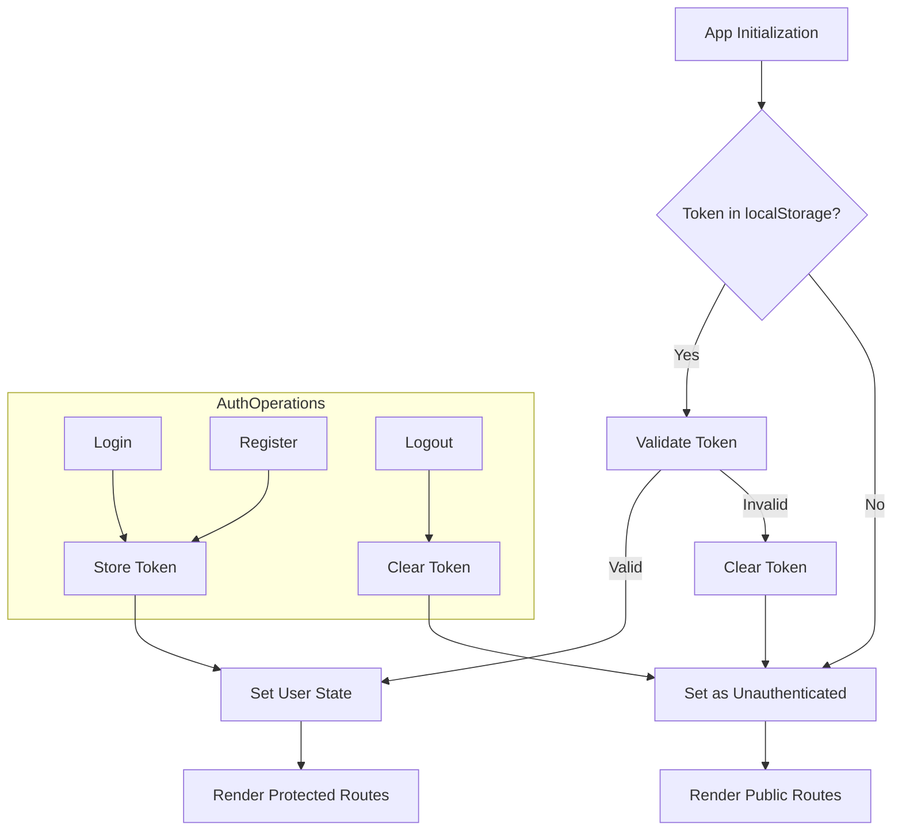

# AuthContext

## Authentication Context Management

<document-code-reference section="Authentication Context Management">
{"files": [
  {
    "name": "Campus-Shield/client/src/contexts/NotificationContext.tsx",
    "description": "Implementation file",
    "file_url": "https://github.com/sparrowdex/Campus-Shield/blob/main/client/src/contexts/NotificationContext.tsx",
    "directory": "https:/github.com/sparrowdex/Campus-Shield/blob/main/client/src/contexts"
  },
  {
    "name": "Campus-Shield/server/middleware/moderator.js",
    "description": "JavaScript/TypeScript implementation file",
    "file_url": "https://github.com/sparrowdex/Campus-Shield/blob/main/server/middleware/moderator.js",
    "directory": "https:/github.com/sparrowdex/Campus-Shield/blob/main/server/middleware"
  },
  {
    "name": "Campus-Shield/server/routes/auth.js",
    "description": "JavaScript/TypeScript implementation file",
    "file_url": "https://github.com/sparrowdex/Campus-Shield/blob/main/server/routes/auth.js",
    "directory": "https:/github.com/sparrowdex/Campus-Shield/blob/main/server/routes"
  },
  {
    "name": "Campus-Shield/server/index.js",
    "description": "JavaScript/TypeScript implementation file",
    "file_url": "https://github.com/sparrowdex/Campus-Shield/blob/main/server/index.js",
    "directory": "https:/github.com/sparrowdex/Campus-Shield/blob/main/server"
  }
]}
</document-code-reference>

The AuthContext component in the Campus-Shield project provides a centralized authentication system for managing user sessions, login/logout functionality, and user role-based access control. It utilizes React's Context API to make authentication state and methods available throughout the application.

<artifact ArtifactUUID="9b0540c6-19b4-409b-978f-18e8df848277">Core Authentication State and Methods</artifact>

The AuthContext defines and manages the following key elements:

- User object: Contains user details like id, email, role, and anonymous status
- Loading state: Indicates if authentication checks are in progress
- Login methods: For regular users, anonymous users, and admin login
- Registration method: For creating new user accounts
- Logout method: For ending user sessions
- Update preferences method: For modifying user settings

```typescript
interface AuthContextType {
  user: User | null;
  loading: boolean;
  login: (email: string, password: string) => Promise<void>;
  register: (email: string, password: string, campusId?: string) => Promise<void>;
  loginAnonymous: (campusId?: string) => Promise<void>;
  logout: () => void;
  updatePreferences: (preferences: any) => Promise<void>;
  adminLogin: (email: string, password: string) => Promise<void>;
}
```

## Authentication Flow Implementation

<document-code-reference section="Authentication Flow Implementation">
{"files": [
  {
    "name": "Campus-Shield/client/src/contexts/AuthContext.tsx",
    "description": "Implementation file",
    "file_url": "https://github.com/sparrowdex/Campus-Shield/blob/main/client/src/contexts/AuthContext.tsx",
    "directory": "https:/github.com/sparrowdex/Campus-Shield/blob/main/client/src/contexts"
  },
  {
    "name": "Campus-Shield/docs/TECH_STACK_AND_WORKFLOW.md",
    "description": "Documentation file",
    "file_url": "https://github.com/sparrowdex/Campus-Shield/blob/main/docs/TECH_STACK_AND_WORKFLOW.md",
    "directory": "https:/github.com/sparrowdex/Campus-Shield/blob/main/docs"
  },
  {
    "name": "Campus-Shield/server/middleware/moderator.js",
    "description": "JavaScript/TypeScript implementation file",
    "file_url": "https://github.com/sparrowdex/Campus-Shield/blob/main/server/middleware/moderator.js",
    "directory": "https:/github.com/sparrowdex/Campus-Shield/blob/main/server/middleware"
  },
  {
    "name": "Campus-Shield/server/routes/auth.js",
    "description": "JavaScript/TypeScript implementation file",
    "file_url": "https://github.com/sparrowdex/Campus-Shield/blob/main/server/routes/auth.js",
    "directory": "https:/github.com/sparrowdex/Campus-Shield/blob/main/server/routes"
  }
]}
</document-code-reference>

<artifact ArtifactUUID="eabfab6f-3c69-4660-b13a-e227c34b9f1b">Token-based Authentication</artifact>

The AuthProvider component implements the authentication logic:

1. On initial load, it checks for an existing token in localStorage
2. If a token exists, it validates it with the server via an API call
3. Successful validation sets the user state and axios default headers
4. Failed validation clears the token and resets the user state

```typescript
useEffect(() => {
  const checkAuth = async () => {
    const token = localStorage.getItem('token');
    if (token) {
      try {
        const response = await axios.get(`${process.env.REACT_APP_API_URL}/api/auth/me`);
        setUser(response.data.user);
      } catch (error) {
        localStorage.removeItem('token');
        delete axios.defaults.headers.common['Authorization'];
      }
    }
    setLoading(false);
  };

  checkAuth();
}, []);
```

## Login and Registration Processes

<document-code-reference section="Login and Registration Processes">
{"files": [
  {
    "name": "Campus-Shield/client/src/pages/Login.tsx",
    "description": "Implementation file",
    "file_url": "https://github.com/sparrowdex/Campus-Shield/blob/main/client/src/pages/Login.tsx",
    "directory": "https:/github.com/sparrowdex/Campus-Shield/blob/main/client/src/pages"
  },
  {
    "name": "Campus-Shield/client/src/contexts/AuthContext.tsx",
    "description": "Implementation file",
    "file_url": "https://github.com/sparrowdex/Campus-Shield/blob/main/client/src/contexts/AuthContext.tsx",
    "directory": "https:/github.com/sparrowdex/Campus-Shield/blob/main/client/src/contexts"
  },
  {
    "name": "Campus-Shield/server/index.js",
    "description": "JavaScript/TypeScript implementation file",
    "file_url": "https://github.com/sparrowdex/Campus-Shield/blob/main/server/index.js",
    "directory": "https:/github.com/sparrowdex/Campus-Shield/blob/main/server"
  },
  {
    "name": "Campus-Shield/client/src/index.tsx",
    "description": "Implementation file",
    "file_url": "https://github.com/sparrowdex/Campus-Shield/blob/main/client/src/index.tsx",
    "directory": "https:/github.com/sparrowdex/Campus-Shield/blob/main/client/src"
  }
]}
</document-code-reference>

The AuthContext provides methods for different types of authentication:

1. Regular user login
2. Anonymous login
3. Admin login
4. User registration

Each method follows a similar pattern:

1. Make an API call to the appropriate endpoint
2. On success, store the returned token in localStorage
3. Set the axios default headers with the new token
4. Update the user state with the returned user object

Example for regular login:

```typescript
const login = async (email: string, password: string) => {
  try {
    const response = await axios.post(`${process.env.REACT_APP_API_URL}/api/auth/login`, {
      email,
      password
    });

    const { token, user } = response.data;
    localStorage.setItem('token', token);
    axios.defaults.headers.common['Authorization'] = `Bearer ${token}`;
    setUser(user);
  } catch (error: any) {
    throw new Error(error.response?.data?.message || 'Login failed');
  }
};
```

## Integration with React Components

<document-code-reference section="Integration with React Components">
{"files": [
  {
    "name": "Campus-Shield/client/src/components/layout/Navbar.tsx",
    "description": "Implementation file",
    "file_url": "https://github.com/sparrowdex/Campus-Shield/blob/main/client/src/components/layout/Navbar.tsx",
    "directory": "https:/github.com/sparrowdex/Campus-Shield/blob/main/client/src/components/layout"
  },
  {
    "name": "Campus-Shield/client/src/react-app-env.d.ts",
    "description": "JavaScript/TypeScript implementation file",
    "file_url": "https://github.com/sparrowdex/Campus-Shield/blob/main/client/src/react-app-env.d.ts",
    "directory": "https:/github.com/sparrowdex/Campus-Shield/blob/main/client/src"
  },
  {
    "name": "Campus-Shield/client/src/components/common/NotificationBar.tsx",
    "description": "Implementation file",
    "file_url": "https://github.com/sparrowdex/Campus-Shield/blob/main/client/src/components/common/NotificationBar.tsx",
    "directory": "https:/github.com/sparrowdex/Campus-Shield/blob/main/client/src/components/common"
  },
  {
    "name": "Campus-Shield/server/index.js",
    "description": "JavaScript/TypeScript implementation file",
    "file_url": "https://github.com/sparrowdex/Campus-Shield/blob/main/server/index.js",
    "directory": "https:/github.com/sparrowdex/Campus-Shield/blob/main/server"
  }
]}
</document-code-reference>

<artifact ArtifactUUID="5826bf00-377b-483c-9cf6-7e3feaa366c3">Using Authentication in Components</artifact>

The AuthContext is consumed by various components throughout the application:

1. Navbar: Displays user information and logout option when authenticated
2. Login/Register pages: Use login and register methods
3. AdminLogin: Uses the specialized admin login method
4. Protected routes: Check user authentication status and role

Example usage in a component:

```typescript
import { useAuth } from '../contexts/AuthContext';

const MyComponent = () => {
  const { user, logout } = useAuth();

  return (
    <div>
      {user ? (
        <>
          <p>Welcome, {user.email}</p>
          <button onClick={logout}>Logout</button>
        </>
      ) : (
        <Link to="/login">Login</Link>
      )}
    </div>
  );
};
```

## Error Handling and User Feedback

<document-code-reference section="Error Handling and User Feedback">
{"files": [
  {
    "name": "Campus-Shield/server/middleware/errorHandler.js",
    "description": "JavaScript/TypeScript implementation file containing request handlers and business logic",
    "file_url": "https://github.com/sparrowdex/Campus-Shield/blob/main/server/middleware/errorHandler.js",
    "directory": "https:/github.com/sparrowdex/Campus-Shield/blob/main/server/middleware"
  },
  {
    "name": "Campus-Shield/server/models/User.js",
    "description": "JavaScript/TypeScript implementation file containing data models and entity definitions",
    "file_url": "https://github.com/sparrowdex/Campus-Shield/blob/main/server/models/User.js",
    "directory": "https:/github.com/sparrowdex/Campus-Shield/blob/main/server/models"
  },
  {
    "name": "Campus-Shield/client/src/contexts/AuthContext.tsx",
    "description": "Implementation file",
    "file_url": "https://github.com/sparrowdex/Campus-Shield/blob/main/client/src/contexts/AuthContext.tsx",
    "directory": "https:/github.com/sparrowdex/Campus-Shield/blob/main/client/src/contexts"
  },
  {
    "name": "Campus-Shield/server/index.js",
    "description": "JavaScript/TypeScript implementation file",
    "file_url": "https://github.com/sparrowdex/Campus-Shield/blob/main/server/index.js",
    "directory": "https:/github.com/sparrowdex/Campus-Shield/blob/main/server"
  }
]}
</document-code-reference>

The AuthContext implements error handling for authentication operations:

1. API call errors are caught and thrown with meaningful messages
2. Components using auth methods can catch these errors and display appropriate feedback
3. Loading state helps components show loading indicators during auth operations

## Security Considerations

<document-code-reference section="Security Considerations">
{"files": [
  {
    "name": "Campus-Shield/client/src/contexts/AuthContext.tsx",
    "description": "Implementation file",
    "file_url": "https://github.com/sparrowdex/Campus-Shield/blob/main/client/src/contexts/AuthContext.tsx",
    "directory": "https:/github.com/sparrowdex/Campus-Shield/blob/main/client/src/contexts"
  },
  {
    "name": "Campus-Shield/server/middleware/moderator.js",
    "description": "JavaScript/TypeScript implementation file",
    "file_url": "https://github.com/sparrowdex/Campus-Shield/blob/main/server/middleware/moderator.js",
    "directory": "https:/github.com/sparrowdex/Campus-Shield/blob/main/server/middleware"
  },
  {
    "name": "Campus-Shield/server/routes/auth.js",
    "description": "JavaScript/TypeScript implementation file",
    "file_url": "https://github.com/sparrowdex/Campus-Shield/blob/main/server/routes/auth.js",
    "directory": "https:/github.com/sparrowdex/Campus-Shield/blob/main/server/routes"
  },
  {
    "name": "Campus-Shield/server/index.js",
    "description": "JavaScript/TypeScript implementation file",
    "file_url": "https://github.com/sparrowdex/Campus-Shield/blob/main/server/index.js",
    "directory": "https:/github.com/sparrowdex/Campus-Shield/blob/main/server"
  }
]}
</document-code-reference>

1. Tokens are stored in localStorage for persistence across sessions
2. Axios default headers are updated with the token for authenticated requests
3. Server-side validation of tokens is performed on protected routes
4. Logout clears the token from both localStorage and axios headers



This comprehensive authentication system ensures secure and flexible user management across the Campus-Shield application, supporting various user roles and authentication methods.
## References:
### Code:
<code-reference uuid='b6bb7f72-7d57-400f-9b4b-c25fb2113d20'>[{"file_name": "Campus-Shield/server/index.js", "file_path": "https://github.com/sparrowdex/Campus-Shield/blob/main/server/index.js", "markdown_link": "- [Campus-Shield/server/index.js](https://github.com/sparrowdex/Campus-Shield/blob/main/server/index.js)\n", "code_chunk": "const express = require('express');\nconst http = require('http');\nconst socketIo = require('socket.io');\nconst cors = require('cors');\nconst helmet = require('helmet');\nconst compression = require('compression');\nconst morgan = require('morgan');\nconst rateLimit = require('express-rate-limit');\nconst path = require('path');\nrequire('dotenv').config();\nconst mongoose = require('mongoose');\n\n// Debug environment variables\nconsole.log('\ud83d\udd0d Environment variables check:');\nconsole.log('NODE_ENV:', process.env.NODE_ENV);\nconsole.log('PORT:', process.env.PORT);\nconsole.log('MONGODB_URI exists:', !!process.env.MONGODB_URI);\nconsole.log('MONGODB_URI length:', process.env.MONGODB_URI ? process.env.MONGODB_URI.length : 0);\nconsole.log('All env vars:', Object.keys(process.env).filter(key => key.includes('MONGO') || key.includes('MONGODB')));\n\nconst connectDB = require('./config/database');\nconst authRoutes = require('./routes/auth');\nconst reportRoutes = require('./routes/reports');\nconst chatRoutes = require('./routes/chat');\nconst adminRoutes = require('./routes/admin');\nconst notificationsRoutes = require('./routes/notifications');\nconst { initializeSocket } = require('./services/socketService');\nconst { errorHandler } = require('./middleware/errorHandler');\n\nconst app = express();\nconst server = http.createServer(app);\nconst io = socketIo(server, {\n  cors: {\n    origin: process.env.CORS_ORIGIN || \"http://localhost:3000\",\n    methods: [\"GET\", \"POST\"]\n  }\n});\n\n// Connect to MongoDB (non-blocking)\nconnectDB().catch(err => {\n  console.error('Failed to connect to database:', err);\n  // Don't exit the process, let it continue\n});\n\n// Initialize Socket.io\ninitializeSocket(io);\n\n// Security middleware\napp.use(helmet({\n  contentSecurityPolicy: {\n    directives: {\n      defaultSrc: [\"'self'\"],\n      styleSrc: [\"'self'\", \"'unsafe-inline'\"],\n      scriptSrc: [\"'self'\"],\n      imgSrc: [\"'self'\", \"[REMOVED_DATA_URI]\n      connectSrc: [\"'self'\", \"ws:\", \"wss:\"]\n    }\n  }\n}));\n\n// Rate limiting\nconst limiter = rateLimit({\n  windowMs: parseInt(process.env.RATE_LIMIT_WINDOW) || 15 * 60 * 1000, // 15 minutes\n  max: parseInt(process.env.RATE_LIMIT_MAX_REQUESTS) || 100,\n  message: 'Too many requests from this IP, please try again later.',\n  standardHeaders: true,\n  legacyHeaders: false,\n});\napp.use('/api/', limiter);\n\n// Middleware\napp.use(compression());\napp.use(morgan('combined'));\n// Apply CORS globally before all routes\nconst allowedOrigins = process.env.CORS_ORIGIN\n  ? process.env.CORS_ORIGIN.split(',').map(origin => origin.trim())\n  : [\"http://localhost:3000\"];\nconsole.log('Allowed CORS origins:', allowedOrigins);\n\napp.use(cors({\n  origin: function(origin, callback) {\n    if (!origin) return callback(null, true);\n    if (allowedOrigins.includes(origin)) return callback(null, true);\n    return callback(new Error('Not allowed by CORS'));\n  },\n  credentials: true\n}));\napp.use(express.json({ limit: '10mb' }));\napp.use(express.urlencoded({ extended: true, limit: '10mb' }));\n\n// Serve uploaded files\napp.use('/uploads', express.static(path.join(__dirname, 'uploads')));\n\n// Health check endpoint\napp.get('/health', (req, res) => {\n  const health = {\n    status: 'OK',\n    timestamp: new Date().toISOString(),\n    uptime: process.uptime(),\n    environment: process.env.NODE_ENV || 'development',\n    database: mongoose.connection.readyState === 1 ? 'connected' : 'disconnected'\n  };\n  \n  res.status(200).json(health);\n});\n\n// API Routes\napp.use('/api/auth', authRoutes);\napp.use('/api/reports', reportRoutes);\napp.use('/api/chat', chatRoutes);\napp.use('/api/admin', adminRoutes);\napp.use('/api/notifications', notificationsRoutes);\n\n// Error handling middleware\napp.use(errorHandler);\n\n// 404 handler\napp.use('*', (req, res) => {\n  res.status(404).json({\n    success: false,\n    message: 'Route not found'\n  });\n});\n\nconst PORT = process.env.PORT || 5000;"}, {"file_name": "Campus-Shield/server/services/memoryStore.js", "file_path": "https://github.com/sparrowdex/Campus-Shield/blob/main/server/services/memoryStore.js", "markdown_link": "- [Campus-Shield/server/services/memoryStore.js](https://github.com/sparrowdex/Campus-Shield/blob/main/server/services/memoryStore.js)\n", "code_chunk": "// Admin request operations\n  createAdminRequest(userId, requestData) {\n    const request = {\n      id: this.nextRequestId.toString(),\n      userId,\n      ...requestData,\n      status: 'pending', // pending, approved, rejected\n      createdAt: new Date().toISOString(),\n      reviewedBy: null,\n      reviewedAt: null,\n      reviewNotes: null\n    };\n    this.adminRequests.set(request.id, request);\n    this.nextRequestId++;\n    return request;\n  }\n\n  getAdminRequests(status = null) {\n    const requests = Array.from(this.adminRequests.values());\n    if (status) {\n      return requests.filter(req => req.status === status);\n    }\n    return requests;\n  }\n\n  updateAdminRequest(requestId, updates) {\n    const request = this.adminRequests.get(requestId);\n    if (request) {\n      Object.assign(request, updates, { \n        reviewedAt: new Date().toISOString(),\n        updatedAt: new Date().toISOString()\n      });\n      this.adminRequests.set(requestId, request);\n      return request;\n    }\n    return null;\n  }\n\n  approveAdminRequest(requestId, approvedBy, notes = '') {\n    const request = this.updateAdminRequest(requestId, {\n      status: 'approved',\n      reviewedBy: approvedBy,\n      reviewNotes: notes\n    });\n\n    if (request) {\n      // Promote user to admin\n      this.updateUser(request.userId, { role: 'admin' });\n    }\n\n    return request;\n  }\n\n  rejectAdminRequest(requestId, rejectedBy, notes = '') {\n    return this.updateAdminRequest(requestId, {\n      status: 'rejected',\n      reviewedBy: rejectedBy,\n      reviewNotes: notes\n    });\n  }\n\n  // Report operations\n  createReport(reportData) {\n    const report = {\n      id: this.nextReportId.toString(),\n      ...reportData,\n      status: 'pending',\n      priority: 'medium',\n      createdAt: new Date().toISOString(),\n      updatedAt: new Date().toISOString(),\n      attachments: [],\n      publicUpdates: []\n    };\n    this.reports.set(report.id, report);\n    this.nextReportId++;\n    return report;\n  }\n\n  findReportsByUserId(userId) {\n    const userReports = [];\n    for (const report of this.reports.values()) {\n      if (report.userId === userId) {\n        userReports.push(report);\n      }\n    }\n    return userReports;\n  }\n\n  findReportById(id) {\n    return this.reports.get(id) || null;\n  }\n\n  updateReport(id, updates) {\n    const report = this.reports.get(id);\n    if (report) {\n      Object.assign(report, updates, { updatedAt: new Date().toISOString() });\n      this.reports.set(id, report);\n      return report;\n    }\n    return null;\n  }\n\n  // Chat operations\n  createChatRoom(roomData) {\n    const room = {\n      roomId: this.nextRoomId.toString(),\n      ...roomData,\n      createdAt: new Date().toISOString(),\n      lastMessage: null\n    };\n    this.chatRooms.set(room.roomId, room);\n    this.nextRoomId++;\n    return room;\n  }\n\n  findChatRoomByReportId(reportId) {\n    for (const room of this.chatRooms.values()) {\n      if (room.reportId === reportId) {\n        return room;\n      }\n    }\n    return null;\n  }\n\n  findChatRoomsByUserId(userId) {\n    const userRooms = [];\n    for (const room of this.chatRooms.values()) {\n      if (room.userId === userId) {\n        userRooms.push(room);\n      }\n    }\n    return userRooms;\n  }\n\n  createMessage(messageData) {\n    const message = {\n      id: this.nextMessageId.toString(),\n      ...messageData,\n      timestamp: new Date().toISOString()\n    };\n    this.messages.set(message.id, message);\n    this.nextMessageId++;\n    return message;\n  }\n\n  findMessagesByRoomId(roomId) {\n    const roomMessages = [];\n    for (const message of this.messages.values()) {\n      if (message.roomId === roomId) {\n        roomMessages.push(message);\n      }\n    }\n    return roomMessages.sort((a, b) => new Date(a.timestamp) - new Date(b.timestamp));\n  }\n\n  // Admin operations\n  getAllReports() {\n    return Array.from(this.reports.values());\n  }\n\n  getAllUsers() {\n    return Array.from(this.users.values());\n  }"}, {"file_name": "Campus-Shield/docs/TECH_STACK_AND_WORKFLOW.md", "file_path": "https://github.com/sparrowdex/Campus-Shield/blob/main/docs/TECH_STACK_AND_WORKFLOW.md", "markdown_link": "- [Campus-Shield/docs/TECH_STACK_AND_WORKFLOW.md](https://github.com/sparrowdex/Campus-Shield/blob/main/docs/TECH_STACK_AND_WORKFLOW.md)\n", "code_chunk": "# CampusShield Tech Stack and Workflow Documentation\n\n## Recommended Tech Stack\n\n| Layer                | Technology Options                                                                                                          | Notes                                                     |\n|----------------------|----------------------------------------------------------------------------------------------------------------------------|-----------------------------------------------------------|\n| **Front-End**        | React.js, React Native (mobile), Flutter (mobile)                                                                          | For web/mobile apps; Flutter enables true cross-platform  |\n| **Back-End/API**     | Node.js (Express.js), Python (FastAPI or Django)                                                                           | Scalable REST APIs, real-time features                    |\n| **Database**         | MongoDB (NoSQL), PostgreSQL (SQL)                                                                                          | MongoDB for flexible data; PostgreSQL for relational data |\n| **Authentication**   | Firebase Auth, Auth0, or custom JWT-based auth                                                                             | Secure sign-in, supports anonymity and OAuth              |\n| **Notifications**    | Firebase Cloud Messaging (push), Twilio (SMS), SendGrid (email)                                                            | Real-time and multi-channel notifications                 |\n| **AI/ML Integration**| Python (scikit-learn, Hugging Face Transformers, spaCy) via an API microservice                                           | For categorization, sentiment analysis, NLP               |\n| **Chat/Real-Time**   | Socket.io (Node.js), WebSockets, or Firebase Realtime Database                                                             | For admin-user anonymous chat, group support              |\n| **Maps/Heatmaps**    | Google Maps API, Mapbox, Leaflet.js                                                                                        | For live incident heatmaps                                |\n| **File Storage**     | AWS S3, Google Cloud Storage, Firebase Storage                                                                             | For reports with photos, voice, or video                  |\n| **Admin Dashboard**  | React (web-based), Chart.js/D3.js for analytics and visualizations                                                         | Data visualization and report management                  |\n| **Hosting/Infra**    | AWS, Google Cloud Platform, Azure, Vercel, Heroku                                                                          | Scalable and easy deployment                              |\n| **Security**         | HTTPS/SSL, end-to-end encryption (Signal Protocol, custom), privacy libraries                                              | To ensure report privacy and anonymous chat               |\n| **Localization**     | i18next, Google Cloud Translation                                                                                          | For multilingual support                                  |\n\n## MVP Tech Stack (Phase 1)\n\nFor the initial MVP, we'll use a simplified but scalable stack:\n\n- **Frontend**: React.js with Tailwind CSS\n- **Backend**: Node.js with Express.js\n- **Database**: MongoDB (flexible schema for reports)\n- **Real-time**: Socket.io for chat and live updates\n- **Authentication**: JWT-based with anonymous options\n- **Maps**: Leaflet.js for heatmap visualization\n- **File Storage**: Local storage initially, cloud storage later\n- **AI/ML**: Basic text classification using natural language processing\n\n## Suggested Workflow\n\n### 1. User Onboarding & Authentication\n- Users sign up with minimal data, choose anonymity (no personal info required).\n- Optional: Offer OAuth (Google, college email) for added features with clear privacy messaging."}, {"file_name": "Campus-Shield/client/src/contexts/AuthContext.tsx", "file_path": "https://github.com/sparrowdex/Campus-Shield/blob/main/client/src/contexts/AuthContext.tsx", "markdown_link": "- [Campus-Shield/client/src/contexts/AuthContext.tsx](https://github.com/sparrowdex/Campus-Shield/blob/main/client/src/contexts/AuthContext.tsx)\n", "code_chunk": "import React, { createContext, useContext, useState, useEffect, ReactNode } from 'react';\nimport axios from 'axios';\n\n// Types\ninterface User {\n  id: string;\n  anonymousId: string;\n  email?: string;\n  role: 'user' | 'admin' | 'moderator';\n  isAnonymous: boolean;\n  campusId?: string;\n}\n\ninterface AuthContextType {\n  user: User | null;\n  loading: boolean;\n  login: (email: string, password: string) => Promise<void>;\n  register: (email: string, password: string, campusId?: string) => Promise<void>;\n  loginAnonymous: (campusId?: string) => Promise<void>;\n  logout: () => void;\n  updatePreferences: (preferences: any) => Promise<void>;\n  adminLogin: (email: string, password: string) => Promise<void>;\n}\n\n// Create context\nconst AuthContext = createContext<AuthContextType | undefined>(undefined);\n\n// Auth provider component\nexport const AuthProvider: React.FC<{ children: ReactNode }> = ({ children }) => {\n  const [user, setUser] = useState<User | null>(null);\n  const [loading, setLoading] = useState(true);\n\n  // Set up axios defaults\n  useEffect(() => {\n    const token = localStorage.getItem('token');\n    if (token) {\n      axios.defaults.headers.common['Authorization'] = `Bearer ${token}`;\n    }\n  }, []);\n\n  // Check if user is logged in on app start\n  useEffect(() => {\n    const checkAuth = async () => {\n      const token = localStorage.getItem('token');\n      if (token) {\n        try {\n          const response = await axios.get(`${process.env.REACT_APP_API_URL}/api/auth/me`);\n          setUser(response.data.user);\n        } catch (error) {\n          localStorage.removeItem('token');\n          delete axios.defaults.headers.common['Authorization'];\n        }\n      }\n      setLoading(false);\n    };\n\n    checkAuth();\n  }, []);\n\n  const login = async (email: string, password: string) => {\n    try {\n      const response = await axios.post(`${process.env.REACT_APP_API_URL}/api/auth/login`, {\n        email,\n        password\n      });\n\n      const { token, user } = response.data;\n      localStorage.setItem('token', token);\n      axios.defaults.headers.common['Authorization'] = `Bearer ${token}`;\n      setUser(user);\n    } catch (error: any) {\n      throw new Error(error.response?.data?.message || 'Login failed');\n    }\n  };\n\n  const register = async (email: string, password: string, campusId?: string) => {\n    try {\n      const response = await axios.post(`${process.env.REACT_APP_API_URL}/api/auth/register`, {\n        email,\n        password,\n        campusId\n      });\n\n      const { token, user } = response.data;\n      localStorage.setItem('token', token);\n      axios.defaults.headers.common['Authorization'] = `Bearer ${token}`;\n      setUser(user);\n    } catch (error: any) {\n      throw new Error(error.response?.data?.message || 'Registration failed');\n    }\n  };\n\n  const loginAnonymous = async (campusId?: string) => {\n    try {\n      const response = await axios.post(`${process.env.REACT_APP_API_URL}/api/auth/anonymous`, {\n        campusId\n      });\n\n      const { token, user } = response.data;\n      localStorage.setItem('token', token);\n      axios.defaults.headers.common['Authorization'] = `Bearer ${token}`;\n      setUser(user);\n    } catch (error: any) {\n      throw new Error(error.response?.data?.message || 'Anonymous login failed');\n    }\n  };\n\n  const logout = () => {\n    localStorage.removeItem('token');\n    delete axios.defaults.headers.common['Authorization'];\n    setUser(null);\n  };\n\n  const updatePreferences = async (preferences: any) => {\n    try {\n      const response = await axios.put(`${process.env.REACT_APP_API_URL}/api/auth/preferences`, preferences);\n      // Update user preferences in state if needed\n    } catch (error: any) {\n      throw new Error(error.response?.data?.message || 'Failed to update preferences');\n    }\n  };"}, {"file_name": "Campus-Shield/client/src/App.tsx", "file_path": "https://github.com/sparrowdex/Campus-Shield/blob/main/client/src/App.tsx", "markdown_link": "- [Campus-Shield/client/src/App.tsx](https://github.com/sparrowdex/Campus-Shield/blob/main/client/src/App.tsx)\n", "code_chunk": "import React from 'react';\nimport { BrowserRouter, Routes, Route, Navigate } from 'react-router-dom';\nimport { AuthProvider, useAuth } from './contexts/AuthContext';\nimport Navbar from './components/layout/Navbar';\nimport Home from './pages/Home';\nimport Login from './pages/Login';\nimport Register from './pages/Register';\nimport AdminLogin from './pages/AdminLogin';\nimport RequestAdmin from './pages/RequestAdmin';\nimport AdminRequests from './pages/AdminRequests';\nimport ReportIncident from './pages/ReportIncident';\nimport MyReports from './pages/MyReports';\nimport AdminDashboard from './pages/AdminDashboard';\nimport Chat from './pages/Chat';\nimport LoadingSpinner from './components/common/LoadingSpinner';\nimport ModeratorDashboard from './pages/ModeratorDashboard';\nimport { NotificationProvider } from './contexts/NotificationContext';\nimport NotificationBar from './components/common/NotificationBar';\nimport { ToastContainer } from 'react-toastify';\nimport 'react-toastify/dist/ReactToastify.css';\n\n// Protected Route Component\nconst ProtectedRoute: React.FC<{ children: React.ReactNode; adminOnly?: boolean; moderatorOnly?: boolean }> = ({\n  children,\n  adminOnly = false,\n  moderatorOnly = false\n}) => {\n  const { user, loading } = useAuth();\n\n  if (loading) return <LoadingSpinner />;\n  if (!user) return <Navigate to=\"/login\" replace />;\n  if (adminOnly && user.role !== 'admin') return <Navigate to=\"/\" replace />;\n  if (moderatorOnly && user.role !== 'moderator') return <Navigate to=\"/\" replace />;\n  return <>{children}</>;\n};\n\n// Main App Component\nconst AppContent: React.FC = () => {\n  const { user } = useAuth();\n\n  return (\n    <div className=\"min-h-screen bg-gray-50\">\n      <Navbar />\n      <main className=\"container mx-auto px-4 py-8\">\n        <Routes>\n          <Route path=\"/\" element={<Home />} />\n          <Route path=\"/login\" element={!user ? <Login /> : <Navigate to=\"/\" replace />} />\n          <Route path=\"/register\" element={!user ? <Register /> : <Navigate to=\"/\" replace />} />\n          <Route path=\"/admin-login\" element={!user ? <AdminLogin /> : <Navigate to=\"/admin\" replace />} />\n          <Route\n            path=\"/request-admin\"\n            element={\n              <ProtectedRoute>\n                <RequestAdmin />\n              </ProtectedRoute>\n            }\n          />\n          <Route\n            path=\"/report\"\n            element={\n              <ProtectedRoute>\n                <ReportIncident />\n              </ProtectedRoute>\n            }\n          />\n          <Route\n            path=\"/my-reports\"\n            element={\n              <ProtectedRoute>\n                <MyReports />\n              </ProtectedRoute>\n            }\n          />\n          <Route\n            path=\"/chat\"\n            element={\n              <ProtectedRoute>\n                <Chat />\n              </ProtectedRoute>\n            }\n          />\n          <Route\n            path=\"/admin\"\n            element={\n              <ProtectedRoute adminOnly>\n                <AdminDashboard />\n              </ProtectedRoute>\n            }\n          />\n          <Route\n            path=\"/admin/requests\"\n            element={\n              <ProtectedRoute moderatorOnly>\n                <AdminRequests />\n              </ProtectedRoute>\n            }\n          />\n          <Route\n            path=\"/moderator\"\n            element={\n              <ProtectedRoute moderatorOnly>\n                <ModeratorDashboard />\n              </ProtectedRoute>\n            }\n          />\n          <Route path=\"*\" element={<Navigate to=\"/\" replace />} />\n        </Routes>\n      </main>\n    </div>\n  );\n};"}, {"file_name": "Campus-Shield/client/src/components/layout/Navbar.tsx", "file_path": "https://github.com/sparrowdex/Campus-Shield/blob/main/client/src/components/layout/Navbar.tsx", "markdown_link": "- [Campus-Shield/client/src/components/layout/Navbar.tsx](https://github.com/sparrowdex/Campus-Shield/blob/main/client/src/components/layout/Navbar.tsx)\n", "code_chunk": "{/* Right side - Auth buttons or user menu */}\n          <div className=\"hidden sm:ml-6 sm:flex sm:items-center\">\n            {user ? (\n              <div className=\"flex items-center space-x-4\">\n                {/* Notification Bell */}\n                <div className=\"relative\">\n                  <button\n                    className=\"relative focus:outline-none\"\n                    onClick={() => setNotifOpen(true)}\n                  >\n                    <BellIcon className=\"h-6 w-6 text-gray-600 hover:text-primary-600\" />\n                    {unread.length > 0 && (\n                      <span className=\"absolute -top-1 -right-1 bg-red-500 text-white text-xs rounded-full px-1.5 py-0.5 font-bold shadow\">\n                        {unread.length}\n                      </span>\n                    )}\n                  </button>\n                </div>\n                <div className=\"flex items-center space-x-2 text-sm text-gray-700\">\n                  <UserIcon className=\"h-4 w-4\" />\n                  <span>\n                    {user.isAnonymous ? 'Anonymous User' : user.email}\n                  </span>\n                  {user.role === 'admin' && (\n                    <span className=\"badge badge-info\">Admin</span>\n                  )}\n                  {user.role === 'moderator' && (\n                    <span className=\"badge badge-warning\">Moderator</span>\n                  )}\n                </div>\n                {user && user.role !== 'admin' && user.role !== 'moderator' && (\n                  <Link to=\"/request-admin\" className=\"text-sm text-primary-600 hover:text-primary-500\">\n                    Request Admin\n                  </Link>\n                )}\n                <button\n                  onClick={handleLogout}\n                  className=\"btn-secondary\"\n                >\n                  Logout\n                </button>\n              </div>\n            ) : (\n              <div className=\"flex items-center space-x-4\">\n                <Link to=\"/login\" className=\"btn-secondary\">\n                  Login\n                </Link>\n                <Link to=\"/register\" className=\"btn-primary\">\n                  Register\n                </Link>\n                <Link to=\"/admin-login\" className=\"text-sm text-gray-500 hover:text-gray-700\">\n                  Admin\n                </Link>\n              </div>\n            )}\n          </div>\n\n          {/* Mobile menu button */}\n          <div className=\"flex items-center sm:hidden\">\n            <button\n              onClick={() => setIsMenuOpen(!isMenuOpen)}\n              className=\"inline-flex items-center justify-center p-2 rounded-md text-gray-400 hover:text-gray-500 hover:bg-gray-100 focus:outline-none focus:ring-2 focus:ring-inset focus:ring-primary-500\"\n            >\n              {isMenuOpen ? (\n                <XMarkIcon className=\"h-6 w-6\" />\n              ) : (\n                <Bars3Icon className=\"h-6 w-6\" />\n              )}\n            </button>\n          </div>\n        </div>\n      </div>"}, {"file_name": "Campus-Shield/client/src/pages/AdminDashboard.tsx", "file_path": "https://github.com/sparrowdex/Campus-Shield/blob/main/client/src/pages/AdminDashboard.tsx", "markdown_link": "- [Campus-Shield/client/src/pages/AdminDashboard.tsx](https://github.com/sparrowdex/Campus-Shield/blob/main/client/src/pages/AdminDashboard.tsx)\n", "code_chunk": "const assignedToIdStr = assignedToId ? String(assignedToId) : null;\n  const currentUserIdStr = currentUserId ? String(currentUserId) : null;\n\n  console.log('currentUserId:', currentUserId);\n  console.log('assignedToId:', assignedToId);\n  console.log('selectedReport:', selectedReport);\n\n  return (\n    <div className=\"max-w-7xl mx-auto\">\n      <div className=\"card\">\n        <div className=\"flex items-center justify-between mb-6\">\n          <h1 className=\"text-2xl font-bold text-gray-900\">Admin Dashboard</h1>\n          <div className=\"flex items-center space-x-4\">\n            {user?.role === 'moderator' && (\n              <Link\n                to=\"/admin/requests\"\n                className=\"btn-primary\"\n              >\n                <ShieldCheckIcon className=\"h-4 w-4 mr-2\" />\n                Admin Requests\n              </Link>\n            )}\n            <div className=\"flex items-center space-x-2 text-sm text-gray-500\">\n              <ShieldCheckIcon className=\"h-5 w-5\" />\n              <span>Administrator Access</span>\n            </div>\n          </div>\n        </div>\n\n        {error && (\n          <div className=\"mb-6 bg-danger-50 border border-danger-200 rounded-md p-4\">\n            <p className=\"text-sm text-danger-700\">{error}</p>\n          </div>\n        )}\n\n        {/* Stats Cards */}\n        {stats && (\n          <div className=\"grid grid-cols-1 md:grid-cols-2 lg:grid-cols-4 gap-6 mb-8\">\n            <div className=\"bg-white p-6 rounded-lg border border-gray-200\">\n              <div className=\"flex items-center\">\n                <div className=\"p-2 bg-primary-100 rounded-lg\">\n                  <UsersIcon className=\"h-6 w-6 text-primary-600\" />\n                </div>\n                <div className=\"ml-4\">\n                  <p className=\"text-sm font-medium text-gray-600\">Total Users</p>\n                  <p className=\"text-2xl font-bold text-gray-900\">{stats.totalUsers}</p>\n                </div>\n              </div>\n            </div>\n\n            <div className=\"bg-white p-6 rounded-lg border border-gray-200\">\n              <div className=\"flex items-center\">\n                <div className=\"p-2 bg-warning-100 rounded-lg\">\n                  <ExclamationTriangleIcon className=\"h-6 w-6 text-warning-600\" />\n                </div>\n                <div className=\"ml-4\">\n                  <p className=\"text-sm font-medium text-gray-600\">Total Reports</p>\n                  <p className=\"text-2xl font-bold text-gray-900\">{stats.totalReports}</p>\n                </div>\n              </div>\n            </div>\n\n            <div className=\"bg-white p-6 rounded-lg border border-gray-200\">\n              <div className=\"flex items-center\">\n                <div className=\"p-2 bg-danger-100 rounded-lg\">\n                  <ClockIcon className=\"h-6 w-6 text-danger-600\" />\n                </div>\n                <div className=\"ml-4\">\n                  <p className=\"text-sm font-medium text-gray-600\">Pending Reports</p>\n                  <p className=\"text-2xl font-bold text-gray-900\">{stats.pendingReports}</p>\n                </div>\n              </div>\n            </div>\n\n            <div className=\"bg-white p-6 rounded-lg border border-gray-200\">\n              <div className=\"flex items-center\">\n                <div className=\"p-2 bg-success-100 rounded-lg\">\n                  <CheckCircleIcon className=\"h-6 w-6 text-success-600\" />\n                </div>\n                <div className=\"ml-4\">\n                  <p className=\"text-sm font-medium text-gray-600\">Resolution Rate</p>\n                  <p className=\"text-2xl font-bold text-gray-900\">{stats.resolutionRate}%</p>\n                </div>\n              </div>\n            </div>\n          </div>\n        )}"}, {"file_name": "Campus-Shield/client/src/pages/RequestAdmin.tsx", "file_path": "https://github.com/sparrowdex/Campus-Shield/blob/main/client/src/pages/RequestAdmin.tsx", "markdown_link": "- [Campus-Shield/client/src/pages/RequestAdmin.tsx](https://github.com/sparrowdex/Campus-Shield/blob/main/client/src/pages/RequestAdmin.tsx)\n", "code_chunk": "<div className=\"bg-blue-50 border border-blue-200 rounded-lg p-4 mb-6\">\n          <div className=\"flex\">\n            <ShieldCheckIcon className=\"h-5 w-5 text-blue-400 mt-0.5\" />\n            <div className=\"ml-3\">\n              <h3 className=\"text-sm font-medium text-blue-800\">Important Information</h3>\n              <div className=\"mt-2 text-sm text-blue-700\">\n                <ul className=\"list-disc list-inside space-y-1\">\n                  <li>Admin access is granted only to authorized campus personnel</li>\n                  <li>Your request will be reviewed by existing administrators only</li>\n                  <li>Only pre-approved admins can approve new admin requests</li>\n                  <li>You will be notified of the decision via email</li>\n                  <li>Please provide a detailed reason for your request</li>\n                </ul>\n              </div>\n            </div>\n          </div>\n        </div>\n\n        <form onSubmit={handleSubmit} className=\"space-y-6\">\n          {/* Personal Information */}\n          <div className=\"bg-gray-50 p-4 rounded-lg\">\n            <h3 className=\"text-lg font-medium text-gray-900 mb-4\">Personal Information</h3>\n            <div className=\"grid grid-cols-1 md:grid-cols-2 gap-4\">\n              <div>\n                <label htmlFor=\"role\" className=\"form-label\">\n                  Your Role/Position *\n                </label>\n                <input\n                  id=\"role\"\n                  name=\"role\"\n                  type=\"text\"\n                  required\n                  value={formData.role}\n                  onChange={handleInputChange}\n                  className=\"input-field\"\n                  placeholder=\"e.g., Security Officer, IT Manager, Dean\"\n                />\n              </div>\n              <div>\n                <label htmlFor=\"department\" className=\"form-label\">\n                  Department/Unit *\n                </label>\n                <input\n                  id=\"department\"\n                  name=\"department\"\n                  type=\"text\"\n                  required\n                  value={formData.department}\n                  onChange={handleInputChange}\n                  className=\"input-field\"\n                  placeholder=\"e.g., Campus Security, IT Services, Student Affairs\"\n                />\n              </div>\n            </div>\n          </div>\n\n          {/* Experience & Qualifications */}\n          <div className=\"bg-gray-50 p-4 rounded-lg\">\n            <h3 className=\"text-lg font-medium text-gray-900 mb-4\">Experience & Qualifications</h3>\n            <div>\n              <label htmlFor=\"experience\" className=\"form-label\">\n                Relevant Experience *\n              </label>\n              <textarea\n                id=\"experience\"\n                name=\"experience\"\n                rows={3}\n                required\n                value={formData.experience}\n                onChange={handleInputChange}\n                className=\"input-field\"\n                placeholder=\"Describe your experience with campus safety, incident management, or administrative systems...\"\n              />\n            </div>\n          </div>\n\n          {/* Responsibilities */}\n          <div className=\"bg-gray-50 p-4 rounded-lg\">\n            <h3 className=\"text-lg font-medium text-gray-900 mb-4\">Responsibilities & Duties</h3>\n            <div>\n              <label htmlFor=\"responsibilities\" className=\"form-label\">\n                Current Responsibilities *\n              </label>\n              <textarea\n                id=\"responsibilities\"\n                name=\"responsibilities\"\n                rows={3}\n                required\n                value={formData.responsibilities}\n                onChange={handleInputChange}\n                className=\"input-field\"\n                placeholder=\"Describe your current responsibilities that would benefit from admin access...\"\n              />\n            </div>\n          </div>"}, {"file_name": "Campus-Shield/client/src/pages/Chat.tsx", "file_path": "https://github.com/sparrowdex/Campus-Shield/blob/main/client/src/pages/Chat.tsx", "markdown_link": "- [Campus-Shield/client/src/pages/Chat.tsx](https://github.com/sparrowdex/Campus-Shield/blob/main/client/src/pages/Chat.tsx)\n", "code_chunk": "import React, { useState, useEffect, useRef, useContext } from 'react';\nimport { \n  PaperAirplaneIcon,\n  UserIcon,\n  ShieldCheckIcon,\n  ClockIcon,\n  ExclamationTriangleIcon,\n  ChatBubbleLeftRightIcon,\n  ArrowLeftIcon\n} from '@heroicons/react/24/outline';\nimport LoadingSpinner from '../components/common/LoadingSpinner';\nimport { useLocation } from 'react-router-dom';\nimport { io, Socket } from 'socket.io-client';\nimport { useAuth } from '../contexts/AuthContext';\nimport { useNotifications } from '../contexts/NotificationContext';\n\ninterface Message {\n  id: string;\n  senderId: string;\n  senderRole: 'user' | 'admin' | 'moderator';\n  message: string;\n  timestamp: string;\n  isAnonymous: boolean;\n}\n\ninterface ChatRoom {\n  _id: string;\n  reportId: string;\n  participants: string[];\n  lastMessage: Message | null;\n  createdAt: string;\n}\n\nconst Chat: React.FC = () => {\n  const location = useLocation();\n  const [chatRooms, setChatRooms] = useState<ChatRoom[]>([]);\n  const [selectedRoom, setSelectedRoom] = useState<string | null>(null);\n  const [messages, setMessages] = useState<Message[]>([]);\n  const [newMessage, setNewMessage] = useState('');\n  const [loading, setLoading] = useState(true);\n  const [sending, setSending] = useState(false);\n  const [error, setError] = useState('');\n  const [reportStatus, setReportStatus] = useState<string | null>(null);\n  const messagesEndRef = useRef<HTMLDivElement>(null);\n  const socketRef = useRef<Socket | null>(null);\n  const { user } = useAuth();\n  const { notifications, markAsRead } = useNotifications();\n  const [showSidebarMobile, setShowSidebarMobile] = useState(true); // mobile: show sidebar or chat\n  const [showDisclaimerModal, setShowDisclaimerModal] = useState(false);\n\n  useEffect(() => {\n    // Connect to Socket.IO server\n    const token = localStorage.getItem('token');\n    const socket = io(process.env.REACT_APP_SOCKET_URL, {\n      auth: { token },\n      transports: ['websocket']\n    });\n    socketRef.current = socket;\n    return () => {\n      socket.disconnect();\n    };\n  }, []);\n\n  useEffect(() => {\n    fetchChatRooms();\n  }, []);\n\n  // Auto-select chat room if reportId is in the URL\n  useEffect(() => {\n    const params = new URLSearchParams(location.search);\n    const reportId = params.get('reportId');\n    if (reportId) {\n      const room = chatRooms.find(r => r.reportId === reportId);\n      if (room) {\n        setSelectedRoom(room._id);\n      } else {\n        // Create the chat room if it doesn't exist\n        const createRoom = async () => {\n          try {\n            const response = await fetch(`${process.env.REACT_APP_API_URL}/api/chat/room`, {\n              method: 'POST',\n              headers: {\n                'Authorization': `Bearer ${localStorage.getItem('token')}`,\n                'Content-Type': 'application/json'\n              },\n              body: JSON.stringify({ reportId })\n            });\n            const data = await response.json();\n            if (response.ok && data.room) {\n              setChatRooms(prev => {\n                // Remove any room with the same roomId or reportId\n                const filtered = prev.filter(r => r._id !== data.room._id && r.reportId !== data.room.reportId);\n                return [...filtered, data.room];\n              });\n              setSelectedRoom(data.room._id);\n            }\n          } catch (err) {\n            // Optionally handle error\n          }\n        };\n        createRoom();\n      }\n    }\n  }, [location.search, chatRooms]);\n\n  useEffect(() => {\n    if (selectedRoom && socketRef.current) {\n      // Join the selected room\n      socketRef.current.emit('join_chat_room', selectedRoom);\n      // Listen for new messages\n      socketRef.current.on('new_message', (msg: Message) => {\n        setMessages(prev => [...prev, msg]);\n      });\n      return () => {\n        socketRef.current?.emit('leave_chat_room', selectedRoom);\n        socketRef.current?.off('new_message');\n      };\n    }\n  }, [selectedRoom]);"}, {"file_name": "Campus-Shield/client/src/pages/Register.tsx", "file_path": "https://github.com/sparrowdex/Campus-Shield/blob/main/client/src/pages/Register.tsx", "markdown_link": "- [Campus-Shield/client/src/pages/Register.tsx](https://github.com/sparrowdex/Campus-Shield/blob/main/client/src/pages/Register.tsx)\n", "code_chunk": "<div>\n              <label htmlFor=\"password\" className=\"form-label\">\n                Password\n              </label>\n              <div className=\"mt-1 relative\">\n                <input\n                  id=\"password\"\n                  name=\"password\"\n                  type={showPassword ? 'text' : 'password'}\n                  autoComplete=\"new-password\"\n                  required\n                  value={formData.password}\n                  onChange={handleChange}\n                  className=\"input-field pr-10\"\n                  placeholder=\"Create a password\"\n                />\n                <button\n                  type=\"button\"\n                  className=\"absolute inset-y-0 right-0 pr-3 flex items-center\"\n                  onClick={() => setShowPassword(!showPassword)}\n                >\n                  {showPassword ? (\n                    <EyeSlashIcon className=\"h-5 w-5 text-gray-400\" />\n                  ) : (\n                    <EyeIcon className=\"h-5 w-5 text-gray-400\" />\n                  )}\n                </button>\n              </div>\n            </div>\n\n            <div>\n              <label htmlFor=\"confirmPassword\" className=\"form-label\">\n                Confirm Password\n              </label>\n              <div className=\"mt-1 relative\">\n                <input\n                  id=\"confirmPassword\"\n                  name=\"confirmPassword\"\n                  type={showConfirmPassword ? 'text' : 'password'}\n                  autoComplete=\"new-password\"\n                  required\n                  value={formData.confirmPassword}\n                  onChange={handleChange}\n                  className=\"input-field pr-10\"\n                  placeholder=\"Confirm your password\"\n                />\n                <button\n                  type=\"button\"\n                  className=\"absolute inset-y-0 right-0 pr-3 flex items-center\"\n                  onClick={() => setShowConfirmPassword(!showConfirmPassword)}\n                >\n                  {showConfirmPassword ? (\n                    <EyeSlashIcon className=\"h-5 w-5 text-gray-400\" />\n                  ) : (\n                    <EyeIcon className=\"h-5 w-5 text-gray-400\" />\n                  )}\n                </button>\n              </div>\n            </div>\n\n            <div>\n              <button\n                type=\"submit\"\n                disabled={loading}\n                className=\"w-full btn-primary disabled:opacity-50 disabled:cursor-not-allowed\"\n              >\n                {loading ? <LoadingSpinner size=\"sm\" color=\"white\" /> : 'Create Account'}\n              </button>\n            </div>\n          </form>\n\n          <div className=\"mt-6\">\n            <div className=\"relative\">\n              <div className=\"absolute inset-0 flex items-center\">\n                <div className=\"w-full border-t border-gray-300\" />\n              </div>\n              <div className=\"relative flex justify-center text-sm\">\n                <span className=\"px-2 bg-white text-gray-500\">Or continue with</span>\n              </div>\n            </div>\n\n            <div className=\"mt-6\">\n              <button\n                onClick={handleAnonymousRegister}\n                disabled={loading}\n                className=\"w-full btn-secondary disabled:opacity-50 disabled:cursor-not-allowed\"\n              >\n                {loading ? <LoadingSpinner size=\"sm\" color=\"primary\" /> : 'Continue Anonymously'}\n              </button>\n            </div>\n          </div>"}, {"file_name": "Campus-Shield/client/src/pages/AdminRequests.tsx", "file_path": "https://github.com/sparrowdex/Campus-Shield/blob/main/client/src/pages/AdminRequests.tsx", "markdown_link": "- [Campus-Shield/client/src/pages/AdminRequests.tsx](https://github.com/sparrowdex/Campus-Shield/blob/main/client/src/pages/AdminRequests.tsx)\n", "code_chunk": "<div className=\"space-y-4\">\n                <div>\n                  <h3 className=\"font-medium text-gray-900 mb-2\">Applicant Information</h3>\n                  <div className=\"grid grid-cols-2 gap-4\">\n                    <div>\n                      <span className=\"text-sm font-medium text-gray-700\">Email:</span>\n                      <p className=\"text-sm text-gray-900\">{selectedRequest.user?.email}</p>\n                    </div>\n                    <div>\n                      <span className=\"text-sm font-medium text-gray-700\">Role:</span>\n                      <p className=\"text-sm text-gray-900\">{selectedRequest.role}</p>\n                    </div>\n                    <div>\n                      <span className=\"text-sm font-medium text-gray-700\">Department:</span>\n                      <p className=\"text-sm text-gray-900\">{selectedRequest.department}</p>\n                    </div>\n                    <div>\n                      <span className=\"text-sm font-medium text-gray-700\">Urgency:</span>\n                      <span className={`inline-flex items-center px-2 py-1 rounded-full text-xs font-medium ${getUrgencyColor(selectedRequest.urgency)}`}>\n                        {selectedRequest.urgency.charAt(0).toUpperCase() + selectedRequest.urgency.slice(1)}\n                      </span>\n                    </div>\n                  </div>\n                </div>\n\n                <div>\n                  <h3 className=\"font-medium text-gray-900 mb-2\">Experience</h3>\n                  <p className=\"text-sm text-gray-700 bg-gray-50 p-3 rounded\">{selectedRequest.experience}</p>\n                </div>\n\n                <div>\n                  <h3 className=\"font-medium text-gray-900 mb-2\">Current Responsibilities</h3>\n                  <p className=\"text-sm text-gray-700 bg-gray-50 p-3 rounded\">{selectedRequest.responsibilities}</p>\n                </div>\n\n                <div>\n                  <h3 className=\"font-medium text-gray-900 mb-2\">Reason for Admin Access</h3>\n                  <p className=\"text-sm text-gray-700 bg-gray-50 p-3 rounded\">{selectedRequest.reason}</p>\n                </div>\n\n                {selectedRequest.contactInfo && (\n                  <div>\n                    <h3 className=\"font-medium text-gray-900 mb-2\">Additional Contact</h3>\n                    <p className=\"text-sm text-gray-700 bg-gray-50 p-3 rounded\">{selectedRequest.contactInfo}</p>\n                  </div>\n                )}\n\n                {selectedRequest.status === 'pending' && (\n                  <div>\n                    <h3 className=\"font-medium text-gray-900 mb-2\">Review Notes</h3>\n                    <textarea\n                      value={reviewNotes}\n                      onChange={(e) => setReviewNotes(e.target.value)}\n                      className=\"input-field\"\n                      rows={3}\n                      placeholder=\"Add notes about your decision...\"\n                    />\n                  </div>\n                )}\n\n                {selectedRequest.status !== 'pending' && selectedRequest.reviewNotes && (\n                  <div>\n                    <h3 className=\"font-medium text-gray-900 mb-2\">Review Notes</h3>\n                    <p className=\"text-sm text-gray-700 bg-gray-50 p-3 rounded\">{selectedRequest.reviewNotes}</p>\n                  </div>\n                )}"}, {"file_name": "Campus-Shield/client/src/pages/ReportIncident.tsx", "file_path": "https://github.com/sparrowdex/Campus-Shield/blob/main/client/src/pages/ReportIncident.tsx", "markdown_link": "- [Campus-Shield/client/src/pages/ReportIncident.tsx](https://github.com/sparrowdex/Campus-Shield/blob/main/client/src/pages/ReportIncident.tsx)\n", "code_chunk": "<div className=\"grid grid-cols-1 md:grid-cols-2 gap-4\">\n                <div>\n                  <label htmlFor=\"address\" className=\"form-label\">\n                    Address\n                  </label>\n                  <input\n                    type=\"text\"\n                    id=\"address\"\n                    name=\"location.address\"\n                    value={formData.location.address}\n                    onChange={handleInputChange}\n                    className=\"input-field\"\n                    placeholder=\"Street address or general area\"\n                  />\n                </div>\n\n                <div>\n                  <label htmlFor=\"building\" className=\"form-label\">\n                    Building\n                  </label>\n                  <input\n                    type=\"text\"\n                    id=\"building\"\n                    name=\"location.building\"\n                    value={formData.location.building}\n                    onChange={handleInputChange}\n                    className=\"input-field\"\n                    placeholder=\"Building name or number\"\n                  />\n                </div>\n              </div>\n\n              <div>\n                <label htmlFor=\"floor\" className=\"form-label\">\n                  Floor/Room\n                </label>\n                <input\n                  type=\"text\"\n                  id=\"floor\"\n                  name=\"location.floor\"\n                  value={formData.location.floor}\n                  onChange={handleInputChange}\n                  className=\"input-field\"\n                  placeholder=\"Floor number or room number\"\n                />\n              </div>\n\n              <div className=\"flex items-center space-x-4\">\n                <button\n                  type=\"button\"\n                  onClick={handleLocationClick}\n                  className=\"btn-secondary\"\n                >\n                  <MapPinIcon className=\"h-4 w-4 mr-2\" />\n                  Use My Current Location\n                </button>\n                {formData.location.coordinates && (\n                  <span className=\"text-sm text-success-600\">\n                    \u2713 Location captured\n                  </span>\n                )}\n              </div>\n            </div>\n          )}\n\n          {/* Step 3: Attachments */}\n          {currentStep === 3 && (\n            <div className=\"space-y-6\">\n              <div className=\"bg-secondary-50 border border-secondary-200 rounded-lg p-4\">\n                <div className=\"flex items-center mb-2\">\n                  <CameraIcon className=\"h-5 w-5 text-secondary-600 mr-2\" />\n                  <h3 className=\"font-medium text-secondary-900\">Attachments (Optional)</h3>\n                </div>\n                <p className=\"text-sm text-secondary-700\">\n                  You can upload photos, videos, or documents related to the incident. Maximum 5 files, 10MB each.\n                </p>\n              </div>\n\n              <div>\n                <button\n                  type=\"button\"\n                  onClick={() => fileInputRef.current?.click()}\n                  className=\"btn-secondary w-full\"\n                >\n                  <DocumentIcon className=\"h-4 w-4 mr-2\" />\n                  Choose Files\n                </button>\n                <input\n                  ref={fileInputRef}\n                  type=\"file\"\n                  multiple\n                  accept=\"image/*,video/*,audio/*,.pdf\"\n                  onChange={handleFileUpload}\n                  className=\"hidden\"\n                />\n              </div>"}, {"file_name": "Campus-Shield/client/src/pages/Home.tsx", "file_path": "https://github.com/sparrowdex/Campus-Shield/blob/main/client/src/pages/Home.tsx", "markdown_link": "- [Campus-Shield/client/src/pages/Home.tsx](https://github.com/sparrowdex/Campus-Shield/blob/main/client/src/pages/Home.tsx)\n", "code_chunk": "{/* Features Section */}\n      <section className=\"bg-gray-50 py-16\">\n        <div className=\"max-w-7xl mx-auto px-4 sm:px-6 lg:px-8\">\n          <div className=\"text-center mb-12\">\n            <h2 className=\"text-3xl md:text-4xl font-bold text-gray-900 mb-4\">\n              Why Choose CampusShield?\n            </h2>\n            <p className=\"text-lg text-gray-600 max-w-2xl mx-auto\">\n              Our privacy-first approach ensures you can report safety concerns without fear, \n              while powerful features help keep everyone informed and protected.\n            </p>\n          </div>\n          \n          <div className=\"grid grid-cols-1 md:grid-cols-2 lg:grid-cols-3 gap-8\">\n            {features.map((feature, index) => (\n              <div key={index} className=\"card hover:shadow-md transition-shadow duration-200\">\n                <div className=\"flex items-center mb-4\">\n                  <feature.icon className=\"h-8 w-8 text-primary-600 mr-3\" />\n                  <h3 className=\"text-lg font-semibold text-gray-900\">\n                    {feature.title}\n                  </h3>\n                </div>\n                <p className=\"text-gray-600\">\n                  {feature.description}\n                </p>\n              </div>\n            ))}\n          </div>\n        </div>\n      </section>\n\n      {/* How It Works Section */}\n      <section className=\"bg-white py-16\">\n        <div className=\"max-w-7xl mx-auto px-4 sm:px-6 lg:px-8\">\n          <div className=\"text-center mb-12\">\n            <h2 className=\"text-3xl md:text-4xl font-bold text-gray-900 mb-4\">\n              How It Works\n            </h2>\n            <p className=\"text-lg text-gray-600 max-w-2xl mx-auto\">\n              Simple, secure, and anonymous reporting in just a few steps.\n            </p>\n          </div>\n          \n          <div className=\"grid grid-cols-1 md:grid-cols-3 gap-8\">\n            <div className=\"text-center\">\n              <div className=\"bg-primary-100 rounded-full w-16 h-16 flex items-center justify-center mx-auto mb-4\">\n                <span className=\"text-2xl font-bold text-primary-600\">1</span>\n              </div>\n              <h3 className=\"text-lg font-semibold text-gray-900 mb-2\">Report Incident</h3>\n              <p className=\"text-gray-600\">\n                Submit a detailed report with location, description, and optional media attachments.\n              </p>\n            </div>\n            \n            <div className=\"text-center\">\n              <div className=\"bg-primary-100 rounded-full w-16 h-16 flex items-center justify-center mx-auto mb-4\">\n                <span className=\"text-2xl font-bold text-primary-600\">2</span>\n              </div>\n              <h3 className=\"text-lg font-semibold text-gray-900 mb-2\">AI Processing</h3>\n              <p className=\"text-gray-600\">\n                Our AI categorizes and prioritizes your report for appropriate response.\n              </p>\n            </div>\n            \n            <div className=\"text-center\">\n              <div className=\"bg-primary-100 rounded-full w-16 h-16 flex items-center justify-center mx-auto mb-4\">\n                <span className=\"text-2xl font-bold text-primary-600\">3</span>\n              </div>\n              <h3 className=\"text-lg font-semibold text-gray-900 mb-2\">Stay Updated</h3>\n              <p className=\"text-gray-600\">\n                Receive updates on your report and chat with authorities if needed.\n              </p>\n            </div>\n          </div>\n        </div>\n      </section>"}]</code-reference>