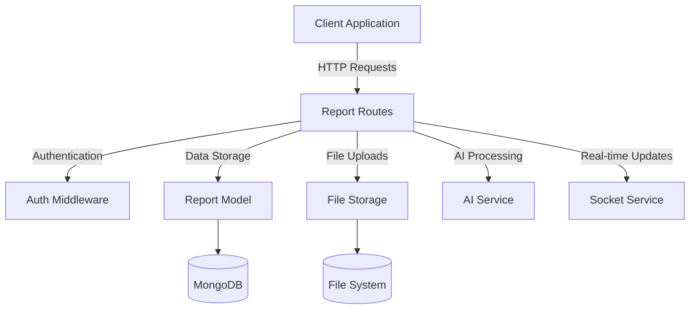

# Report Routes

## Report Routes Component

<document-code-reference section="Report Routes Component">
{"files": [
  {
    "name": "Campus-Shield/client/src/pages/MyReports.tsx",
    "description": "Implementation file",
    "file_url": "https://github.com/sparrowdex/Campus-Shield/blob/main/client/src/pages/MyReports.tsx",
    "directory": "https:/github.com/sparrowdex/Campus-Shield/blob/main/client/src/pages"
  },
  {
    "name": "Campus-Shield/server/routes/admin.js",
    "description": "JavaScript/TypeScript implementation file",
    "file_url": "https://github.com/sparrowdex/Campus-Shield/blob/main/server/routes/admin.js",
    "directory": "https:/github.com/sparrowdex/Campus-Shield/blob/main/server/routes"
  },
  {
    "name": "Campus-Shield/client/src/reportWebVitals.ts",
    "description": "JavaScript/TypeScript implementation file",
    "file_url": "https://github.com/sparrowdex/Campus-Shield/blob/main/client/src/reportWebVitals.ts",
    "directory": "https:/github.com/sparrowdex/Campus-Shield/blob/main/client/src"
  },
  {
    "name": "Campus-Shield/client/src/components/layout/Navbar.tsx",
    "description": "Implementation file",
    "file_url": "https://github.com/sparrowdex/Campus-Shield/blob/main/client/src/components/layout/Navbar.tsx",
    "directory": "https:/github.com/sparrowdex/Campus-Shield/blob/main/client/src/components/layout"
  }
]}
</document-code-reference>

The Report Routes component is a critical part of the CampusShield system, handling all API endpoints related to incident reporting. It provides functionality for submitting new reports, retrieving existing reports, and managing report data.

### Core Functionality

The main responsibilities of the Report Routes component include:

- Handling POST requests to create new incident reports
- Processing GET requests to retrieve reports (filtered by user role)
- Managing file uploads for report attachments
- Integrating with AI services for report categorization and sentiment analysis
- Implementing data validation and sanitization
- Enforcing authentication and authorization

### Key Endpoints

1. POST /api/reports
   - Creates a new incident report
   - Handles file uploads (images, videos, audio, PDFs)
   - Integrates with AI services for categorization and sentiment analysis

2. GET /api/reports
   - Retrieves reports based on user role (regular users see only their reports, admins see all)
   - Implements pagination, filtering, and sorting

3. GET /api/reports/:id
   - Retrieves a specific report by ID
   - Enforces access control based on user role

4. GET /api/reports/heatmap/data
   - Provides data for generating incident heatmaps
   - Allows date range and category filtering

5. GET /api/reports/nearby
   - Retrieves reports near a specified location
   - Useful for location-based reporting and analysis

### <artifact ArtifactUUID="a5d59227-d17c-4ee8-b0d5-db4c22bf6199">Authentication and Authorization</artifact>

The Report Routes component uses middleware for authentication and role-based access control:

```javascript
const auth = require('../middleware/auth');
const admin = require('../middleware/admin');
const moderator = require('../middleware/moderator');
```

These middleware functions ensure that only authenticated users can access report endpoints, and certain operations are restricted to admin or moderator roles.

### <artifact ArtifactUUID="2af86229-4927-4d2d-8183-521d3c4c6284">Data Validation and Sanitization</artifact>

The component uses express-validator for input validation and sanitization:

```javascript
const { body, validationResult, query } = require('express-validator');
```

This ensures that all incoming data is properly validated before processing, preventing potential security vulnerabilities and data integrity issues.

### Integration with AI Services

The Report Routes component integrates with AI services for advanced report processing:

```javascript
const { categorizeReport, analyzeSentiment } = require('../services/aiService');
```

These functions are used to automatically categorize reports and analyze the sentiment of report descriptions, enhancing the system's ability to prioritize and respond to incidents.

### <artifact ArtifactUUID="9133edcb-667d-4661-9b72-6b2f8f3585e7">File Upload Handling</artifact>

The component uses multer for handling file uploads:

```javascript
const multer = require('multer');
const storage = multer.diskStorage({
  destination: (req, file, cb) => {
    cb(null, 'uploads/');
  },
  filename: (req, file, cb) => {
    const uniqueSuffix = Date.now() + '-' + Math.round(Math.random() * 1E9);
    cb(null, file.fieldname + '-' + uniqueSuffix + path.extname(file.originalname));
  }
});
```

This configuration allows for secure and efficient handling of file attachments, including proper naming and storage.

### Error Handling and Response Format

The Report Routes component implements consistent error handling and response formatting:

```javascript
res.status(400).json({ success: false, errors: errors.array() });
```

This ensures that all API responses follow a standardized format, making it easier for client-side applications to handle both successful and error scenarios.

### Database Interaction

The component interacts with the MongoDB database using the Mongoose ORM:

```javascript
const Report = require('../models/Report');
```

This allows for efficient querying, creation, and updating of report data in the database.

## Connection to Other Components

<document-code-reference section="Connection to Other Components">
{"files": [
  {
    "name": "Campus-Shield/server/routes/reports.js",
    "description": "JavaScript/TypeScript implementation file",
    "file_url": "https://github.com/sparrowdex/Campus-Shield/blob/main/server/routes/reports.js",
    "directory": "https:/github.com/sparrowdex/Campus-Shield/blob/main/server/routes"
  },
  {
    "name": "Campus-Shield/client/src/components/layout/Navbar.tsx",
    "description": "Implementation file",
    "file_url": "https://github.com/sparrowdex/Campus-Shield/blob/main/client/src/components/layout/Navbar.tsx",
    "directory": "https:/github.com/sparrowdex/Campus-Shield/blob/main/client/src/components/layout"
  },
  {
    "name": "Campus-Shield/server/index.js",
    "description": "JavaScript/TypeScript implementation file",
    "file_url": "https://github.com/sparrowdex/Campus-Shield/blob/main/server/index.js",
    "directory": "https:/github.com/sparrowdex/Campus-Shield/blob/main/server"
  },
  {
    "name": "Campus-Shield/client/src/index.tsx",
    "description": "Implementation file",
    "file_url": "https://github.com/sparrowdex/Campus-Shield/blob/main/client/src/index.tsx",
    "directory": "https:/github.com/sparrowdex/Campus-Shield/blob/main/client/src"
  }
]}
</document-code-reference>

The Report Routes component is tightly integrated with other parts of the CampusShield system:



This diagram illustrates how the Report Routes component interacts with various other components and services within the CampusShield ecosystem, showcasing its central role in the incident reporting process.
## References:
### Code:
<code-reference uuid='9287a578-a652-46c2-9008-97a70134ad3b'>[{"file_name": "Campus-Shield/server/index.js", "file_path": "https://github.com/sparrowdex/Campus-Shield/blob/main/server/index.js", "markdown_link": "- [Campus-Shield/server/index.js](https://github.com/sparrowdex/Campus-Shield/blob/main/server/index.js)\n", "code_chunk": "const express = require('express');\nconst http = require('http');\nconst socketIo = require('socket.io');\nconst cors = require('cors');\nconst helmet = require('helmet');\nconst compression = require('compression');\nconst morgan = require('morgan');\nconst rateLimit = require('express-rate-limit');\nconst path = require('path');\nrequire('dotenv').config();\nconst mongoose = require('mongoose');\n\n// Debug environment variables\nconsole.log('\ud83d\udd0d Environment variables check:');\nconsole.log('NODE_ENV:', process.env.NODE_ENV);\nconsole.log('PORT:', process.env.PORT);\nconsole.log('MONGODB_URI exists:', !!process.env.MONGODB_URI);\nconsole.log('MONGODB_URI length:', process.env.MONGODB_URI ? process.env.MONGODB_URI.length : 0);\nconsole.log('All env vars:', Object.keys(process.env).filter(key => key.includes('MONGO') || key.includes('MONGODB')));\n\nconst connectDB = require('./config/database');\nconst authRoutes = require('./routes/auth');\nconst reportRoutes = require('./routes/reports');\nconst chatRoutes = require('./routes/chat');\nconst adminRoutes = require('./routes/admin');\nconst notificationsRoutes = require('./routes/notifications');\nconst { initializeSocket } = require('./services/socketService');\nconst { errorHandler } = require('./middleware/errorHandler');\n\nconst app = express();\nconst server = http.createServer(app);\nconst io = socketIo(server, {\n  cors: {\n    origin: process.env.CORS_ORIGIN || \"http://localhost:3000\",\n    methods: [\"GET\", \"POST\"]\n  }\n});\n\n// Connect to MongoDB (non-blocking)\nconnectDB().catch(err => {\n  console.error('Failed to connect to database:', err);\n  // Don't exit the process, let it continue\n});\n\n// Initialize Socket.io\ninitializeSocket(io);\n\n// Security middleware\napp.use(helmet({\n  contentSecurityPolicy: {\n    directives: {\n      defaultSrc: [\"'self'\"],\n      styleSrc: [\"'self'\", \"'unsafe-inline'\"],\n      scriptSrc: [\"'self'\"],\n      imgSrc: [\"'self'\", \"[REMOVED_DATA_URI]\n      connectSrc: [\"'self'\", \"ws:\", \"wss:\"]\n    }\n  }\n}));\n\n// Rate limiting\nconst limiter = rateLimit({\n  windowMs: parseInt(process.env.RATE_LIMIT_WINDOW) || 15 * 60 * 1000, // 15 minutes\n  max: parseInt(process.env.RATE_LIMIT_MAX_REQUESTS) || 100,\n  message: 'Too many requests from this IP, please try again later.',\n  standardHeaders: true,\n  legacyHeaders: false,\n});\napp.use('/api/', limiter);\n\n// Middleware\napp.use(compression());\napp.use(morgan('combined'));\n// Apply CORS globally before all routes\nconst allowedOrigins = process.env.CORS_ORIGIN\n  ? process.env.CORS_ORIGIN.split(',').map(origin => origin.trim())\n  : [\"http://localhost:3000\"];\nconsole.log('Allowed CORS origins:', allowedOrigins);\n\napp.use(cors({\n  origin: function(origin, callback) {\n    if (!origin) return callback(null, true);\n    if (allowedOrigins.includes(origin)) return callback(null, true);\n    return callback(new Error('Not allowed by CORS'));\n  },\n  credentials: true\n}));\napp.use(express.json({ limit: '10mb' }));\napp.use(express.urlencoded({ extended: true, limit: '10mb' }));\n\n// Serve uploaded files\napp.use('/uploads', express.static(path.join(__dirname, 'uploads')));\n\n// Health check endpoint\napp.get('/health', (req, res) => {\n  const health = {\n    status: 'OK',\n    timestamp: new Date().toISOString(),\n    uptime: process.uptime(),\n    environment: process.env.NODE_ENV || 'development',\n    database: mongoose.connection.readyState === 1 ? 'connected' : 'disconnected'\n  };\n  \n  res.status(200).json(health);\n});\n\n// API Routes\napp.use('/api/auth', authRoutes);\napp.use('/api/reports', reportRoutes);\napp.use('/api/chat', chatRoutes);\napp.use('/api/admin', adminRoutes);\napp.use('/api/notifications', notificationsRoutes);\n\n// Error handling middleware\napp.use(errorHandler);\n\n// 404 handler\napp.use('*', (req, res) => {\n  res.status(404).json({\n    success: false,\n    message: 'Route not found'\n  });\n});\n\nconst PORT = process.env.PORT || 5000;"}, {"file_name": "Campus-Shield/server/routes/reports.js", "file_path": "https://github.com/sparrowdex/Campus-Shield/blob/main/server/routes/reports.js", "markdown_link": "- [Campus-Shield/server/routes/reports.js](https://github.com/sparrowdex/Campus-Shield/blob/main/server/routes/reports.js)\n", "code_chunk": "const express = require('express');\nconst multer = require('multer');\nconst path = require('path');\nconst { body, validationResult, query } = require('express-validator');\nconst Report = require('../models/Report');\nconst auth = require('../middleware/auth');\nconst { categorizeReport, analyzeSentiment } = require('../services/aiService');\nconst memoryStore = require('../services/memoryStore');\n\nconst router = express.Router();\n\n// Check if MongoDB is connected\nconst isMongoConnected = () => {\n  return Report.db && Report.db.readyState === 1;\n};\n\n// Configure multer for file uploads\nconst storage = multer.diskStorage({\n  destination: (req, file, cb) => {\n    cb(null, 'uploads/');\n  },\n  filename: (req, file, cb) => {\n    const uniqueSuffix = Date.now() + '-' + Math.round(Math.random() * 1E9);\n    cb(null, file.fieldname + '-' + uniqueSuffix + path.extname(file.originalname));\n  }\n});\n\nconst upload = multer({\n  storage: storage,\n  limits: {\n    fileSize: 10 * 1024 * 1024, // 10MB limit\n  },\n  fileFilter: (req, file, cb) => {\n    const allowedTypes = /jpeg|jpg|png|gif|mp4|avi|mov|wav|mp3|pdf/;\n    const extname = allowedTypes.test(path.extname(file.originalname).toLowerCase());\n    const mimetype = allowedTypes.test(file.mimetype);\n    \n    if (mimetype && extname) {\n      return cb(null, true);\n    } else {\n      cb(new Error('Only image, video, audio, and PDF files are allowed'));\n    }\n  }\n});\n\n// @route   POST /api/reports\n// @desc    Submit a new incident report\n// @access  Private\nrouter.post('/', auth, upload.array('attachments', 5), [\n  body('title').isLength({ min: 5, max: 200 }).withMessage('Title must be between 5 and 200 characters'),\n  body('description').isLength({ min: 10, max: 2000 }).withMessage('Description must be between 10 and 2000 characters'),\n  body('category').isIn([\n    'harassment', 'assault', 'theft', 'vandalism', 'suspicious_activity',\n    'emergency', 'safety_hazard', 'discrimination', 'bullying', 'other'\n  ]).withMessage('Invalid category'),\n  // Add a custom sanitizer for coordinates\n  body('location.coordinates').customSanitizer(value => {\n    if (typeof value === 'string') {\n      try {\n        return JSON.parse(value);\n      } catch {\n        return value;\n      }\n    }\n    return value;\n  }),\n  body('location.coordinates').isArray({ min: 2, max: 2 }).withMessage('Location coordinates are required'),\n  body('location.coordinates.*').isFloat().withMessage('Coordinates must be numbers'),\n  body('incidentTime').optional().isISO8601().withMessage('Invalid date format')\n], async (req, res) => {\n  try {\n    const errors = validationResult(req);\n    if (!errors.isEmpty()) {\n      return res.status(400).json({ success: false, errors: errors.array() });\n    }\n\n    const {\n      title,\n      description,\n      category,\n      location,\n      incidentTime\n    } = req.body;\n\n    // Get user info\n    const user = req.user;\n\n    // Process attachments\n    const attachments = req.files ? req.files.map(file => ({\n      filename: file.filename,\n      originalName: file.originalname,\n      mimetype: file.mimetype,\n      size: file.size,\n      path: file.path\n    })) : [];\n\n    // Parse coordinates if sent as a string\n    let coordinates = location.coordinates;\n    if (typeof coordinates === 'string') {\n      try {\n        coordinates = JSON.parse(coordinates);\n      } catch (e) {\n        coordinates = undefined;\n      }\n    }\n\n    // Create report data\n    const reportData = {\n      reporterId: user.userId,\n      title,\n      description,\n      category,\n      location: {\n        type: 'Point',\n        coordinates: coordinates || location.coordinates,\n        address: location.address || '',\n        building: location.building || '',\n        floor: location.floor || ''\n      },\n      incidentTime: incidentTime || new Date(),\n      attachments,\n      isAnonymous: user.isAnonymous || true,\n      ipAddress: req.ip,\n      userAgent: req.get('User-Agent')\n    };"}, {"file_name": "Campus-Shield/server/models/Report.js", "file_path": "https://github.com/sparrowdex/Campus-Shield/blob/main/server/models/Report.js", "markdown_link": "- [Campus-Shield/server/models/Report.js](https://github.com/sparrowdex/Campus-Shield/blob/main/server/models/Report.js)\n", "code_chunk": "const mongoose = require('mongoose');\n\nconst reportSchema = new mongoose.Schema({\n  // Anonymous reporter identification\n  reporterId: {\n    type: String,\n    required: true,\n    index: true\n  },\n  \n  // Report content\n  title: {\n    type: String,\n    required: true,\n    maxlength: 200,\n    trim: true\n  },\n  \n  description: {\n    type: String,\n    required: true,\n    maxlength: 2000,\n    trim: true\n  },\n  \n  // Incident categorization\n  category: {\n    type: String,\n    required: true,\n    enum: [\n      'harassment',\n      'assault',\n      'theft',\n      'vandalism',\n      'suspicious_activity',\n      'emergency',\n      'safety_hazard',\n      'discrimination',\n      'bullying',\n      'other'\n    ]\n  },\n  \n  // AI-generated fields\n  aiCategory: {\n    type: String,\n    enum: [\n      'harassment',\n      'assault',\n      'theft',\n      'vandalism',\n      'suspicious_activity',\n      'emergency',\n      'safety_hazard',\n      'discrimination',\n      'bullying',\n      'other'\n    ]\n  },\n  \n  priority: {\n    type: String,\n    enum: ['low', 'medium', 'high', 'critical'],\n    default: 'medium'\n  },\n  \n  sentiment: {\n    type: String,\n    enum: ['positive', 'neutral', 'negative', 'distressed'],\n    default: 'neutral'\n  },\n  \n  // Location data (generalized for privacy)\n  location: {\n    type: {\n      type: String,\n      enum: ['Point'],\n      default: 'Point'\n    },\n    coordinates: {\n      type: [Number], // [longitude, latitude]\n      required: true,\n      index: '2dsphere'\n    },\n    address: {\n      type: String,\n      maxlength: 200\n    },\n    building: {\n      type: String,\n      maxlength: 100\n    },\n    floor: {\n      type: String,\n      maxlength: 20\n    }\n  },\n  \n  // Timestamp\n  incidentTime: {\n    type: Date,\n    required: true,\n    default: Date.now\n  },\n  \n  // Media attachments\n  attachments: [{\n    filename: String,\n    originalName: String,\n    mimetype: String,\n    size: Number,\n    path: String,\n    uploadedAt: {\n      type: Date,\n      default: Date.now\n    }\n  }],\n  \n  // Report status and handling\n  status: {\n    type: String,\n    enum: ['pending', 'under_review', 'investigating', 'resolved', 'closed'],\n    default: 'pending'\n  },\n  \n  assignedTo: {\n    type: mongoose.Schema.Types.ObjectId,\n    ref: 'User'\n  },\n  \n  // Admin notes (private)\n  adminNotes: [{\n    note: String,\n    addedBy: {\n      type: mongoose.Schema.Types.ObjectId,\n      ref: 'User'\n    },\n    addedAt: {\n      type: Date,\n      default: Date.now\n    }\n  }],\n  \n  // Public updates for reporter\n  publicUpdates: [{\n    message: String,\n    addedAt: {\n      type: Date,\n      default: Date.now\n    }\n  }],\n  \n  // Privacy and data retention\n  isAnonymous: {\n    type: Boolean,\n    default: true\n  },\n  \n  dataRetentionDate: {\n    type: Date,\n    default: () => new Date(Date.now() + 2 * 365 * 24 * 60 * 60 * 1000) // 2 years\n  },\n  \n  // Metadata\n  ipAddress: {\n    type: String,\n    required: false // Hashed for privacy\n  },\n  \n  userAgent: {\n    type: String,\n    required: false\n  },\n  \n  createdAt: {\n    type: Date,\n    default: Date.now,\n    index: true\n  },\n  \n  updatedAt: {\n    type: Date,\n    default: Date.now\n  }\n});\n\n// Indexes for performance\nreportSchema.index({ createdAt: -1 });\nreportSchema.index({ status: 1, createdAt: -1 });\nreportSchema.index({ category: 1, createdAt: -1 });\nreportSchema.index({ priority: 1, status: 1 });\nreportSchema.index({ 'location.coordinates': '2dsphere' });\nreportSchema.index({ dataRetentionDate: 1 });\n\n// Pre-save middleware\nreportSchema.pre('save', function(next) {\n  this.updatedAt = Date.now();\n  next();\n});\n\n// Method to add admin note\nreportSchema.methods.addAdminNote = function(note, adminId) {\n  this.adminNotes.push({\n    note,\n    addedBy: adminId\n  });\n  return this.save();\n};\n\n// Method to add public update\nreportSchema.methods.addPublicUpdate = function(message) {\n  this.publicUpdates.push({\n    message\n  });\n  return this.save();\n};"}, {"file_name": "Campus-Shield/client/src/components/IncidentHeatMap.tsx", "file_path": "https://github.com/sparrowdex/Campus-Shield/blob/main/client/src/components/IncidentHeatMap.tsx", "markdown_link": "- [Campus-Shield/client/src/components/IncidentHeatMap.tsx](https://github.com/sparrowdex/Campus-Shield/blob/main/client/src/components/IncidentHeatMap.tsx)\n", "code_chunk": "import React, { useEffect, useState } from 'react';\nimport { MapContainer, TileLayer, useMap } from 'react-leaflet';\nimport 'leaflet/dist/leaflet.css';\nimport 'leaflet.heat';\n\ninterface Report {\n  _id: string;\n  location: {\n    coordinates: [number, number]; // [lng, lat]\n  };\n}\n\nconst HeatmapLayer: React.FC<{ points: [number, number][] }> = ({ points }) => {\n  const map = useMap();\n  useEffect(() => {\n    // @ts-ignore\n    if (window.L && points.length) {\n      // Remove existing heat layer if any\n      if ((map as any)._heatLayer) {\n        (map as any).removeLayer((map as any)._heatLayer);\n      }\n      // @ts-ignore\n      const heat = window.L.heatLayer(points, { radius: 25, blur: 15, maxZoom: 17 });\n      heat.addTo(map);\n      (map as any)._heatLayer = heat;\n    }\n  }, [map, points]);\n  return null;\n};\n\nconst IncidentHeatMap: React.FC = () => {\n  const [points, setPoints] = useState<[number, number][]>([]);\n  const [loading, setLoading] = useState(true);\n\n  useEffect(() => {\n    const fetchReports = async () => {\n      try {\n        const token = localStorage.getItem('token');\n        const res = await fetch(`${process.env.REACT_APP_API_URL}/api/reports`, {\n          headers: {\n            'Authorization': `Bearer ${token}`,\n            'Content-Type': 'application/json'\n          }\n        });\n        const data = await res.json();\n        if (data.success && Array.isArray(data.reports)) {\n          // Convert [lng, lat] to [lat, lng] for Leaflet\n          const pts = data.reports\n            .filter((r: Report) => r.location && Array.isArray(r.location.coordinates))\n            .map((r: Report) => [r.location.coordinates[1], r.location.coordinates[0]]);\n          setPoints(pts);\n        }\n      } catch (err) {\n        // Handle error\n      } finally {\n        setLoading(false);\n      }\n    };\n    fetchReports();\n  }, []);\n\n  return (\n    <div className=\"w-full h-[500px] rounded shadow overflow-hidden\">\n      {loading ? (\n        <div className=\"flex items-center justify-center h-full\">Loading heatmap...</div>\n      ) : (\n        <MapContainer center={[20.5937, 78.9629]} zoom={5} style={{ height: '100%', width: '100%' }}>\n          <TileLayer\n            attribution='&copy; <a href=\"https://www.openstreetmap.org/copyright\">OpenStreetMap</a> contributors'\n            url=\"https://{s}.tile.openstreetmap.org/{z}/{x}/{y}.png\"\n          />\n          <HeatmapLayer points={points} />\n        </MapContainer>\n      )}\n    </div>\n  );\n};\n\nexport default IncidentHeatMap;"}, {"file_name": "Campus-Shield/client/src/pages/MyReports.tsx", "file_path": "https://github.com/sparrowdex/Campus-Shield/blob/main/client/src/pages/MyReports.tsx", "markdown_link": "- [Campus-Shield/client/src/pages/MyReports.tsx](https://github.com/sparrowdex/Campus-Shield/blob/main/client/src/pages/MyReports.tsx)\n", "code_chunk": "{/* Report Detail Modal */}\n      {selectedReport && (\n        <div className=\"fixed inset-0 bg-black bg-opacity-50 flex items-center justify-center p-4 z-50\">\n          <div className=\"bg-white rounded-lg max-w-2xl w-full max-h-[90vh] overflow-y-auto\">\n            <div className=\"p-6\">\n              <div className=\"flex items-center justify-between mb-4\">\n                <h2 className=\"text-xl font-bold text-gray-900\">Report Details</h2>\n                <button\n                  onClick={() => setSelectedReport(null)}\n                  className=\"text-gray-400 hover:text-gray-600\"\n                >\n                  <XMarkIcon className=\"h-6 w-6\" />\n                </button>\n              </div>\n\n              <div className=\"space-y-4\">\n                <div>\n                  <h3 className=\"font-semibold text-gray-900 mb-2\">{selectedReport.title}</h3>\n                  <div className=\"flex items-center space-x-3 mb-3\">\n                    <span className={`badge ${statusColors[selectedReport.status as keyof typeof statusColors]}`}>\n                      {selectedReport.status.replace('_', ' ').toUpperCase()}\n                    </span>\n                    <span className={`badge ${priorityColors[selectedReport.priority as keyof typeof priorityColors]}`}>\n                      {selectedReport.priority.toUpperCase()}\n                    </span>\n                  </div>\n                </div>\n\n                <div>\n                  <h4 className=\"font-medium text-gray-900 mb-2\">Description</h4>\n                  <p className=\"text-gray-600\">{selectedReport.description}</p>\n                </div>\n\n                <div className=\"grid grid-cols-1 md:grid-cols-2 gap-4\">\n                  <div>\n                    <h4 className=\"font-medium text-gray-900 mb-2\">Category</h4>\n                    <p className=\"text-gray-600 capitalize\">\n                      {categoryLabels[selectedReport.category as keyof typeof categoryLabels]}\n                    </p>\n                  </div>\n                  <div>\n                    <h4 className=\"font-medium text-gray-900 mb-2\">Incident Time</h4>\n                    <p className=\"text-gray-600\">{formatDate(selectedReport.incidentTime)}</p>\n                  </div>\n                </div>\n\n                                 <div>\n                   <h4 className=\"font-medium text-gray-900 mb-2\">Location</h4>\n                   <div className=\"text-gray-600\">\n                     {selectedReport.location?.address && <p>{selectedReport.location.address}</p>}\n                     {selectedReport.location?.building && <p>Building: {selectedReport.location.building}</p>}\n                     {selectedReport.location?.floor && <p>Floor: {selectedReport.location.floor}</p>}\n                     {!selectedReport.location?.address && !selectedReport.location?.building && !selectedReport.location?.floor && (\n                       <p className=\"text-gray-500\">Location not specified</p>\n                     )}\n                   </div>\n                 </div>\n\n                                 {selectedReport.attachments && selectedReport.attachments.length > 0 && (\n                   <div>\n                     <h4 className=\"font-medium text-gray-900 mb-2\">Attachments</h4>\n                     <div className=\"space-y-2\">\n                       {selectedReport.attachments.map((file, index) => (\n                         <div key={index} className=\"flex items-center space-x-2 text-sm text-gray-600\">\n                           <DocumentIcon className=\"h-4 w-4\" />\n                           <span>{file.originalName || file.filename || 'Unknown file'}</span>\n                         </div>\n                       ))}\n                     </div>\n                   </div>\n                 )}"}, {"file_name": "Campus-Shield/docs/TECH_STACK_AND_WORKFLOW.md", "file_path": "https://github.com/sparrowdex/Campus-Shield/blob/main/docs/TECH_STACK_AND_WORKFLOW.md", "markdown_link": "- [Campus-Shield/docs/TECH_STACK_AND_WORKFLOW.md](https://github.com/sparrowdex/Campus-Shield/blob/main/docs/TECH_STACK_AND_WORKFLOW.md)\n", "code_chunk": "# CampusShield Tech Stack and Workflow Documentation\n\n## Recommended Tech Stack\n\n| Layer                | Technology Options                                                                                                          | Notes                                                     |\n|----------------------|----------------------------------------------------------------------------------------------------------------------------|-----------------------------------------------------------|\n| **Front-End**        | React.js, React Native (mobile), Flutter (mobile)                                                                          | For web/mobile apps; Flutter enables true cross-platform  |\n| **Back-End/API**     | Node.js (Express.js), Python (FastAPI or Django)                                                                           | Scalable REST APIs, real-time features                    |\n| **Database**         | MongoDB (NoSQL), PostgreSQL (SQL)                                                                                          | MongoDB for flexible data; PostgreSQL for relational data |\n| **Authentication**   | Firebase Auth, Auth0, or custom JWT-based auth                                                                             | Secure sign-in, supports anonymity and OAuth              |\n| **Notifications**    | Firebase Cloud Messaging (push), Twilio (SMS), SendGrid (email)                                                            | Real-time and multi-channel notifications                 |\n| **AI/ML Integration**| Python (scikit-learn, Hugging Face Transformers, spaCy) via an API microservice                                           | For categorization, sentiment analysis, NLP               |\n| **Chat/Real-Time**   | Socket.io (Node.js), WebSockets, or Firebase Realtime Database                                                             | For admin-user anonymous chat, group support              |\n| **Maps/Heatmaps**    | Google Maps API, Mapbox, Leaflet.js                                                                                        | For live incident heatmaps                                |\n| **File Storage**     | AWS S3, Google Cloud Storage, Firebase Storage                                                                             | For reports with photos, voice, or video                  |\n| **Admin Dashboard**  | React (web-based), Chart.js/D3.js for analytics and visualizations                                                         | Data visualization and report management                  |\n| **Hosting/Infra**    | AWS, Google Cloud Platform, Azure, Vercel, Heroku                                                                          | Scalable and easy deployment                              |\n| **Security**         | HTTPS/SSL, end-to-end encryption (Signal Protocol, custom), privacy libraries                                              | To ensure report privacy and anonymous chat               |\n| **Localization**     | i18next, Google Cloud Translation                                                                                          | For multilingual support                                  |\n\n## MVP Tech Stack (Phase 1)\n\nFor the initial MVP, we'll use a simplified but scalable stack:\n\n- **Frontend**: React.js with Tailwind CSS\n- **Backend**: Node.js with Express.js\n- **Database**: MongoDB (flexible schema for reports)\n- **Real-time**: Socket.io for chat and live updates\n- **Authentication**: JWT-based with anonymous options\n- **Maps**: Leaflet.js for heatmap visualization\n- **File Storage**: Local storage initially, cloud storage later\n- **AI/ML**: Basic text classification using natural language processing\n\n## Suggested Workflow\n\n### 1. User Onboarding & Authentication\n- Users sign up with minimal data, choose anonymity (no personal info required).\n- Optional: Offer OAuth (Google, college email) for added features with clear privacy messaging."}, {"file_name": "Campus-Shield/server/routes/admin.js", "file_path": "https://github.com/sparrowdex/Campus-Shield/blob/main/server/routes/admin.js", "markdown_link": "- [Campus-Shield/server/routes/admin.js](https://github.com/sparrowdex/Campus-Shield/blob/main/server/routes/admin.js)\n", "code_chunk": "report.status = status;\n      report.updatedAt = new Date();\n      await report.save();\n\n      res.json({\n        success: true,\n        report: {\n          id: report._id,\n          status: report.status,\n          updatedAt: report.updatedAt\n        }\n      });\n    } else {\n      // Use memory store\n      const updatedReport = memoryStore.updateReport(id, { status });\n      if (!updatedReport) {\n        return res.status(404).json({\n          success: false,\n          message: 'Report not found'\n        });\n      }\n\n      res.json({\n        success: true,\n        report: {\n          id: updatedReport.id,\n          status: updatedReport.status,\n          updatedAt: updatedReport.updatedAt\n        }\n      });\n    }\n\n  } catch (error) {\n    console.error('Update report status error:', error);\n    res.status(500).json({\n      success: false,\n      message: 'Server error'\n    });\n  }\n});\n\n// @route   POST /api/admin/reports/:id/note\n// @desc    Add admin note to report\n// @access  Private (Admin only)\nrouter.post('/reports/:id/note', auth, admin, [\n  body('note').isLength({ min: 1, max: 1000 }).withMessage('Note must be between 1 and 1000 characters')\n], async (req, res) => {\n  try {\n    const errors = validationResult(req);\n    if (!errors.isEmpty()) {\n      return res.status(400).json({ success: false, errors: errors.array() });\n    }\n\n    const { id } = req.params;\n    const { note } = req.body;\n\n    const report = await Report.findById(id);\n    if (!report) {\n      return res.status(404).json({\n        success: false,\n        message: 'Report not found'\n      });\n    }\n\n    await report.addAdminNote(note, req.user.userId);\n\n    res.json({\n      success: true,\n      message: 'Admin note added successfully'\n    });\n\n  } catch (error) {\n    console.error('Add admin note error:', error);\n    res.status(500).json({\n      success: false,\n      message: 'Server error'\n    });\n  }\n});\n\n// @route   POST /api/admin/reports/:id/update\n// @desc    Add public update to report\n// @access  Private (Admin only)\nrouter.post('/reports/:id/update', auth, admin, [\n  body('message').isLength({ min: 1, max: 500 }).withMessage('Message must be between 1 and 500 characters')\n], async (req, res) => {\n  try {\n    const errors = validationResult(req);\n    if (!errors.isEmpty()) {\n      return res.status(400).json({ success: false, errors: errors.array() });\n    }\n\n    const { id } = req.params;\n    const { message } = req.body;\n\n    const report = await Report.findById(id);\n    if (!report) {\n      return res.status(404).json({\n        success: false,\n        message: 'Report not found'\n      });\n    }\n\n    await report.addPublicUpdate(message);\n\n    res.json({\n      success: true,\n      message: 'Public update added successfully'\n    });\n\n  } catch (error) {\n    console.error('Add public update error:', error);\n    res.status(500).json({\n      success: false,\n      message: 'Server error'\n    });\n  }\n});\n\n// @route   GET /api/admin/analytics\n// @desc    Get analytics data\n// @access  Private (Admin only)\nrouter.get('/analytics', auth, admin, [\n  query('startDate').optional().isISO8601(),\n  query('endDate').optional().isISO8601()\n], async (req, res) => {\n  try {\n    const { startDate, endDate } = req.query;\n    \n    const start = startDate ? new Date(startDate) : new Date(Date.now() - 30 * 24 * 60 * 60 * 1000);\n    const end = endDate ? new Date(endDate) : new Date();\n\n    // Daily reports trend\n    const dailyTrend = await Report.aggregate([\n      {\n        $match: {\n          createdAt: { $gte: start, $lte: end }\n        }\n      },\n      {\n        $group: {\n          _id: {\n            $dateToString: { format: \"%Y-%m-%d\", date: \"$createdAt\" }\n          },\n          count: { $sum: 1 }\n        }\n      },\n      {\n        $sort: { _id: 1 }\n      }\n    ]);"}, {"file_name": "Campus-Shield/client/src/pages/ReportIncident.tsx", "file_path": "https://github.com/sparrowdex/Campus-Shield/blob/main/client/src/pages/ReportIncident.tsx", "markdown_link": "- [Campus-Shield/client/src/pages/ReportIncident.tsx](https://github.com/sparrowdex/Campus-Shield/blob/main/client/src/pages/ReportIncident.tsx)\n", "code_chunk": "<div className=\"grid grid-cols-1 md:grid-cols-2 gap-4\">\n                <div>\n                  <label htmlFor=\"address\" className=\"form-label\">\n                    Address\n                  </label>\n                  <input\n                    type=\"text\"\n                    id=\"address\"\n                    name=\"location.address\"\n                    value={formData.location.address}\n                    onChange={handleInputChange}\n                    className=\"input-field\"\n                    placeholder=\"Street address or general area\"\n                  />\n                </div>\n\n                <div>\n                  <label htmlFor=\"building\" className=\"form-label\">\n                    Building\n                  </label>\n                  <input\n                    type=\"text\"\n                    id=\"building\"\n                    name=\"location.building\"\n                    value={formData.location.building}\n                    onChange={handleInputChange}\n                    className=\"input-field\"\n                    placeholder=\"Building name or number\"\n                  />\n                </div>\n              </div>\n\n              <div>\n                <label htmlFor=\"floor\" className=\"form-label\">\n                  Floor/Room\n                </label>\n                <input\n                  type=\"text\"\n                  id=\"floor\"\n                  name=\"location.floor\"\n                  value={formData.location.floor}\n                  onChange={handleInputChange}\n                  className=\"input-field\"\n                  placeholder=\"Floor number or room number\"\n                />\n              </div>\n\n              <div className=\"flex items-center space-x-4\">\n                <button\n                  type=\"button\"\n                  onClick={handleLocationClick}\n                  className=\"btn-secondary\"\n                >\n                  <MapPinIcon className=\"h-4 w-4 mr-2\" />\n                  Use My Current Location\n                </button>\n                {formData.location.coordinates && (\n                  <span className=\"text-sm text-success-600\">\n                    \u2713 Location captured\n                  </span>\n                )}\n              </div>\n            </div>\n          )}\n\n          {/* Step 3: Attachments */}\n          {currentStep === 3 && (\n            <div className=\"space-y-6\">\n              <div className=\"bg-secondary-50 border border-secondary-200 rounded-lg p-4\">\n                <div className=\"flex items-center mb-2\">\n                  <CameraIcon className=\"h-5 w-5 text-secondary-600 mr-2\" />\n                  <h3 className=\"font-medium text-secondary-900\">Attachments (Optional)</h3>\n                </div>\n                <p className=\"text-sm text-secondary-700\">\n                  You can upload photos, videos, or documents related to the incident. Maximum 5 files, 10MB each.\n                </p>\n              </div>\n\n              <div>\n                <button\n                  type=\"button\"\n                  onClick={() => fileInputRef.current?.click()}\n                  className=\"btn-secondary w-full\"\n                >\n                  <DocumentIcon className=\"h-4 w-4 mr-2\" />\n                  Choose Files\n                </button>\n                <input\n                  ref={fileInputRef}\n                  type=\"file\"\n                  multiple\n                  accept=\"image/*,video/*,audio/*,.pdf\"\n                  onChange={handleFileUpload}\n                  className=\"hidden\"\n                />\n              </div>"}, {"file_name": "Campus-Shield/client/src/pages/Home.tsx", "file_path": "https://github.com/sparrowdex/Campus-Shield/blob/main/client/src/pages/Home.tsx", "markdown_link": "- [Campus-Shield/client/src/pages/Home.tsx](https://github.com/sparrowdex/Campus-Shield/blob/main/client/src/pages/Home.tsx)\n", "code_chunk": "{/* Features Section */}\n      <section className=\"bg-gray-50 py-16\">\n        <div className=\"max-w-7xl mx-auto px-4 sm:px-6 lg:px-8\">\n          <div className=\"text-center mb-12\">\n            <h2 className=\"text-3xl md:text-4xl font-bold text-gray-900 mb-4\">\n              Why Choose CampusShield?\n            </h2>\n            <p className=\"text-lg text-gray-600 max-w-2xl mx-auto\">\n              Our privacy-first approach ensures you can report safety concerns without fear, \n              while powerful features help keep everyone informed and protected.\n            </p>\n          </div>\n          \n          <div className=\"grid grid-cols-1 md:grid-cols-2 lg:grid-cols-3 gap-8\">\n            {features.map((feature, index) => (\n              <div key={index} className=\"card hover:shadow-md transition-shadow duration-200\">\n                <div className=\"flex items-center mb-4\">\n                  <feature.icon className=\"h-8 w-8 text-primary-600 mr-3\" />\n                  <h3 className=\"text-lg font-semibold text-gray-900\">\n                    {feature.title}\n                  </h3>\n                </div>\n                <p className=\"text-gray-600\">\n                  {feature.description}\n                </p>\n              </div>\n            ))}\n          </div>\n        </div>\n      </section>\n\n      {/* How It Works Section */}\n      <section className=\"bg-white py-16\">\n        <div className=\"max-w-7xl mx-auto px-4 sm:px-6 lg:px-8\">\n          <div className=\"text-center mb-12\">\n            <h2 className=\"text-3xl md:text-4xl font-bold text-gray-900 mb-4\">\n              How It Works\n            </h2>\n            <p className=\"text-lg text-gray-600 max-w-2xl mx-auto\">\n              Simple, secure, and anonymous reporting in just a few steps.\n            </p>\n          </div>\n          \n          <div className=\"grid grid-cols-1 md:grid-cols-3 gap-8\">\n            <div className=\"text-center\">\n              <div className=\"bg-primary-100 rounded-full w-16 h-16 flex items-center justify-center mx-auto mb-4\">\n                <span className=\"text-2xl font-bold text-primary-600\">1</span>\n              </div>\n              <h3 className=\"text-lg font-semibold text-gray-900 mb-2\">Report Incident</h3>\n              <p className=\"text-gray-600\">\n                Submit a detailed report with location, description, and optional media attachments.\n              </p>\n            </div>\n            \n            <div className=\"text-center\">\n              <div className=\"bg-primary-100 rounded-full w-16 h-16 flex items-center justify-center mx-auto mb-4\">\n                <span className=\"text-2xl font-bold text-primary-600\">2</span>\n              </div>\n              <h3 className=\"text-lg font-semibold text-gray-900 mb-2\">AI Processing</h3>\n              <p className=\"text-gray-600\">\n                Our AI categorizes and prioritizes your report for appropriate response.\n              </p>\n            </div>\n            \n            <div className=\"text-center\">\n              <div className=\"bg-primary-100 rounded-full w-16 h-16 flex items-center justify-center mx-auto mb-4\">\n                <span className=\"text-2xl font-bold text-primary-600\">3</span>\n              </div>\n              <h3 className=\"text-lg font-semibold text-gray-900 mb-2\">Stay Updated</h3>\n              <p className=\"text-gray-600\">\n                Receive updates on your report and chat with authorities if needed.\n              </p>\n            </div>\n          </div>\n        </div>\n      </section>"}]</code-reference>