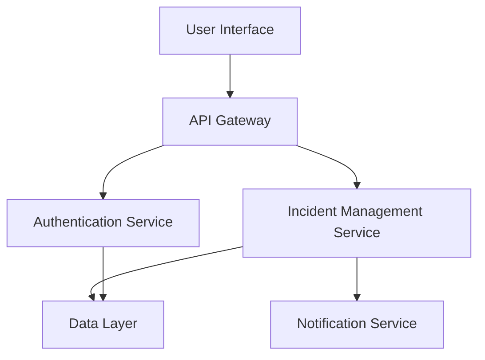

# Architecture Overview

## Architecture Overview

The Campus-Shield project is designed to provide a robust and scalable solution for campus security management. This section provides a high-level overview of the system architecture, detailing the core components, their relationships, and the design principles guiding the development of the system.

### System Design

**Overall Architecture Pattern:**

The Campus-Shield system follows a microservices architecture pattern. This approach allows for modular development, where each service is independently deployable, scalable, and maintainable. The microservices communicate with each other through well-defined APIs, ensuring loose coupling and high cohesion.

**Core Components and Their Relationships:**

1. **User Interface (UI) Service:**
   - Provides the front-end interface for users to interact with the system.
   - Communicates with the API Gateway to fetch and display data.

2. **API Gateway:**
   - Acts as a single entry point for all client requests.
   - Routes requests to the appropriate microservices and aggregates responses.

3. **Authentication Service:**
   - Handles user authentication and authorization.
   - Ensures secure access to the system's resources.

4. **Incident Management Service:**
   - Manages the reporting and tracking of security incidents.
   - Interfaces with the Notification Service to alert relevant personnel.

5. **Notification Service:**
   - Sends alerts and notifications via email, SMS, or push notifications.
   - Integrates with third-party messaging services for reliable delivery.

6. **Data Layer:**
   - Consists of a centralized database that stores user information, incident reports, and system logs.
   - Utilizes a relational database management system for data persistence.

**Data Flow and Processing Patterns:**

- Data flows from the UI Service to the API Gateway, which then directs it to the appropriate microservices for processing.
- Processed data is stored in the Data Layer, ensuring consistency and reliability.
- Notifications are triggered based on specific events and conditions, ensuring timely communication.

### Component Structure

### Integration Points

- **External Dependencies and APIs:**
  - Utilizes third-party APIs for messaging and notifications.
  - Integrates with campus security systems for real-time data exchange.

- **Database Connections and Data Persistence:**
  - Connects to a PostgreSQL database for data storage.
  - Employs ORM (Object-Relational Mapping) for seamless data manipulation.

- **Third-Party Service Integrations:**
  - Integrates with cloud-based services for scalability and redundancy.
  - Uses external authentication providers for single sign-on (SSO) capabilities.

### Design Principles

- **Key Architectural Decisions:**
  - Adoption of microservices for flexibility and scalability.
  - Use of API Gateway to streamline communication and enhance security.

- **Scalability Considerations:**
  - Services are horizontally scalable to handle increased load.
  - Load balancing is implemented to distribute traffic evenly across services.

- **Security Implementation Approach:**
  - Implements OAuth 2.0 for secure authentication and authorization.
  - Data encryption is applied both in transit and at rest to protect sensitive information.

This architecture overview provides a clear understanding of the Campus-Shield system, enabling developers to effectively contribute to its development and maintenance.